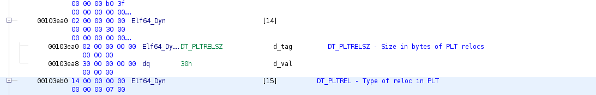
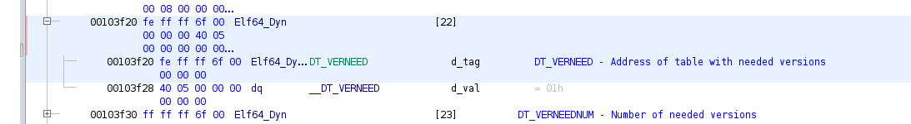

# dynamic

A lot of this is based off of `http://osr507doc.sco.com/en/topics/ELF_dynam_section.html` and `https://refspecs.linuxfoundation.org/LSB_2.1.0/LSB-Core-generic/LSB-Core-generic/dynsectent.html`

So, if an object file participates in dynamic linking, it will contain the `.dynamic` section. The `.dyanmic` section is a table, where each entry in the table describes some information that is useful for dyanmic linking. In addition to that, there will also be a `PT_DYNAMIC` segment that contains the `.dynamic` section.

This is the structure of an entry, it varies from `32/64` bit (copied from `https://docs.oracle.com/cd/E23824_01/html/819-0690/chapter6-42444.html`):

```
typedef struct {
        Elf32_Sword d_tag;
        union {
                Elf32_Word      d_val;
                Elf32_Addr      d_ptr;
                Elf32_Off       d_off;
        } d_un;
} Elf32_Dyn;

typedef struct {
        Elf64_Xword d_tag;
        union {
                Elf64_Xword     d_val;
                Elf64_Addr      d_ptr;
        } d_un;
} Elf64_Dyn;
```

An entry contains two entries, a `d_tag`, and either a `d_val/d_ptr` (or even `d_off` for `32` bit). The purpose of the first value, is to specify what type of dynamic object is being defined. The second value, is the actual value.

The union there, is so we can define it to have either a memory address, or an integer value in the source code. However both have the same datasize.

# dynamic types chart

So below, there is a chart detailing the various types. It will list the `d_tag` value for the various different dyamic types.

In addition to that, depending on if the elf file is an executable or relocatable (specified by the `e_type` value in the elf header), different dynamic types will either be required, optional, or ignored.

Also, we display if the `d_un` value is either a `d_val` or `d_ptr`. This chart is from `https://docs.oracle.com/cd/E19683-01/817-3677/chapter6-42444/index.html`.

| Name | Value | d_un | Exeuctable | Shared Object |
| ----- | ----- | ----- | ----- | ----- |
| DT_NULL | 0x00 | NA | Mandatory | Mandatory |
| DT_NEEDED | 0x01 | d_val | Optional | Optional |
| DT_PLTRELSZ | 0x02 | d_val | Optional | Optional |
| DT_PLTGOT | 0x03 | d_val | Optional | Optional |
| DT_HASH | 0x04 | d_ptr | Mandatory | Mandatory |
| DT_STRTAB | 0x05 | d_ptr | Mandatory | Mandatory |
| DT_SYMTAB | 0x06 | d_ptr | Mandatory | Mandatory |
| DT_RELA | 0x07 | d_ptr | Mandatory | Optional |
| DT_RELASZ | 0x08 | d_val | Mandatory | Optional |
| DT_RELAENT | 0x09 | d_val | Mandatory | Optional |
| DT_STRSZ | 0x0A | d_val | Mandatory | Mandatory |
| DT_SYMENT | 0x0B | d_val | Mandatory | Mandatory |
| DT_INIT | 0x0C | d_ptr | Optional | Optional |
| DT_FINI | 0x0D | d_ptr | Optional | Optional |
| DT_SONAME | 0x0E | d_val | Ignored | Optional |
| DT_RPATH | 0x0F | d_val | Optional | Optional |
| DT_SYMBOLIC | 0x10 | NA | Ignored | Optional |
| DT_REL | 0x11 | d_ptr | Mandatory | Optional |
| DT_RELSZ | 0x12 | d_val | Mandatory | Optional |
| DT_RELENT | 0x13 | d_val | Mandatory | Optional |
| DT_PLTREL | 0x14 | d_val | Mandatory | Optional |
| DT_DEBUG | 0x15 | d_ptr | Optional | Ignored |
| DT_TEXTREL | 0x16 | NA | Optional | Optional |
| DT_JMPREL | 0x17 | d_ptr | Optional | Optional |
| DT_BIND_NOW | 0x18 | NA | Optional | Optional |
| DT_INIT_ARRAY | 0x19 | d_ptr | Optional | Optional |
| DT_FINI_ARRAY | 0x1A | d_ptr | Optional | Optional |
| DT_INIT_ARRAYSZ | 0x1B | d_ptr | Optional | Optional |
| DT_FINI_ARRAYSZ | 0x1C | d_val | Optional | Optional |
| DT_RUNPATH | 0x1D | d_val | Optional | Optional |
| DT_FLAGS | 0x1E | d_val | Optional | Optional |
| DT_ENCODING | 0x1F | NA | NA | NA |
| DT_PREINIT_ARRAY | 0x20 | d_ptr | Optional | Ignored |
| DT_PREINIT_ARRAYSZ | 0x21 | d_val | Optional | Ignored |
| DT_HIOS | 0x6ffff000 | NA | NA | NA |
| DT_LOOS | 0x6000000d | NA | NA | NA |
| DT_LOPROC | 0x70000000 | NA | NA | NA |
| DT_HIPROC | 0x7fffffff | NA | NA | NA |

# dynamic types

Now, there are a ton of different types for these entries. Here will be brief descriptions of each of them:

#### DT_NULL

This is simply an empty entry, which marks the end of the table (the array). Think of it like a null terminator to a string.


#### DT_NEEDED

The purpose of this entry, is to specify a string to a needed library. The value to this specifies an offset to a string table, to the string name of the library.

Let's take a look at an example, where the needed library is `0x1004c4`. In this case, the offset is `0x2c`:


Looking at the section header table for the `.dynamic` section, we see it's `sh_link` index is `7`


Which maps to the `dynstr` section:


Which in the `.dynstr` section, at offset `0x2c` (`0x00100498 + 0x2c = 0x1004c4`), we see the string `libc.so.6`:


#### DT_PLTRELSZ

This value holds the size, in bytes, of relocations with the PLT (procedure linkage table). This must be present if `DT_JMPREL` is present.



#### DT_PLTGOT

This value holds an address, associated with the Global Offset Table (addresses where PLT funcs expect the linked addresses to be). While the exact meaning of this address can change depending on the processor/os, it seems here to point to the start of the GOT (Global Offset Table):


#### DT_HASH

So this entry, will contain the address of the symbol hash table.


#### DT_STRTAB

This holds the address of the string symbol table:


Which we see, is the `.dynstr` section:


#### DT_SYMTAB

This holds the address of the symbol table:


Which we see, points to the `.dynsym` section:


#### DT_RELA

This entry holds the address, to a `rela` relocation table:


Which we see this one, points to the `.rela.dyn` section (the `.rela.plt` has `DT_JMPREL` to point to it):


#### DT_RELASZ

This holds the size, in bytes, of the relocation table specified by the `DT_RELA` entry:


The relocation table pointed to by the earlier `DT_RELA` begins at `0x00100570` and ends at `0x00100630`, so a size of `0xc0` makes sense (`0x00100630 - 0x00100570 = 0xc0`).

#### DT_RELAENT

This value holds the size, in butes, of a DT_RELA relocation entry:


#### DT_STRSZ

This value, contains the size in bytes, of the string table specified by `DT_STRTAB`. Earlier, we saw that the string table here was the `.dynstr` section. We see that it begins at `0x00100498`, and ends at `0x0010052a`, so it's size is `0x0010052a - 0x00100498 = 0x92`, which matches this entry. 


#### DT_SYMENT

This value holds the size, in bytes, of a symbol table entry.


 Here it is `0x18`, which is what we'd expect it to be (just looking at the symbols in the `.symtab` section, `0x00` than `0x18`, then `0x30`, then `0x48`, etc.):


#### DT_INIT

This value holds the address of the initialization function.


#### DT_FINI

This value holds the address of the termination function.


#### DT_SONAME

This is an offset into the `DT_STRTAB` entry. The offset is a string, to the name of a shared object (`.so` library).

This screenshot is from `libc.so`:


#### DT_RPATH

This field holds an offset into the string table specified by the `DT_STRTAB` entry. The string is a path to a search library.

#### DT_SYMBOLIC

If this dynamic entry is present in a shared object library (`.so file`), that means that the dynamic linker should first look to this `.so` file for symbol resolution, then to the executable and other object files to resolve the symbol.

#### DT_REL

This value holds the address, to the `.rel` table (assuming it has one). This value is sort of the `.rel` equivalent to `DT_RELA`.

#### DT_RELSZ

This holds the size, in bytes, of the `.rel` table (assuming it has one). This value is sort of the `.rel` equivalent to `DT_RELASZ`.

#### DT_RELENT

This holds the size, in bytes, of a `rel` relocation. This value is sort of the `.rel` equivalent to `DT_RELAENT`.

#### DT_PLTREL

This specifies if the relocation entries are either `rel`s, or `relas`. If this value is `DT_RELA` (`7`), that means it is `rela`. Likewise if it is `DT_REL` (`0x11`), it is `rel`.


#### DT_DEBUG

This entry's value specifies debugging information (not too sure what that means in practice).


#### DT_TEXTREL

If this dynamic entry type is present, that means that a relocation will have to write to a non-writeable memory segment, as specified by the Program Header Table. The inverse is also true, where if this is absent, no relocation should have to write to a non-writeable segment.

#### DT_JMPREL

So this entry holds an address, to relocations dealing specifically with the PLT (procedure linkage table). If this field is present, the `DT_PLTRELSZ` and `DT_PLTREL` dynamic entries must also be included. 


Which we see, points to the `.rela.plt` section:


#### DT_HIPROC/DT_LOPROC

These values again, form a range for processor specific dynamic entry types.

#### DT_INIT_ARRAY

This field, specifies the address to the init function array (array of function pointers called on program initialization).


Looking at this init array, we see it only holds a single `8` byte function ptr:


#### DT_INIT_ARRAYSZ

This field holds the size, in bytes of the `init` array.


#### DT_FINI_ARRAY

This field, specifies the address to the fini function array (array of function pointers called on program termination).


Looking at this fini array, we see it only holds a single `8` byte function ptr:


#### DT_FINI_ARRAYSZ

This field holds the size, in bytes of the `fini` array.


#### DT_FLAGS

This field's value holds bit flags, that each have specific meanings. For more info, checkout `https://docs.oracle.com/cd/E19683-01/816-1386/chapter6-42444/index.html`.


#### DT_FLAGS_1

This field's value holds bit flags, that each have specific meanings. For more info, checkout `https://docs.oracle.com/cd/E19683-01/816-1386/chapter6-42444/index.html`.


#### DT_VERNEED

This field's value holds the address to the version dependency table. For more information as to the format of the table checkout `https://docs.oracle.com/cd/E19683-01/817-3677/6mj8mbtc9/index.html#chapter6-61174`:



We see this points to the `.gnu.version_r` section, however ghidra doesn't appear to recognize the datastructure:


#### DT_VERNEEDNUM

This value specifies the number of entries in the version dependency table specified by `DT_VERNEED`.


#### DT_VERDEF

This value specifies the address to the version definitiont able. For more information as to the format of the table checkout `https://docs.oracle.com/cd/E19683-01/817-3677/6mj8mbtc9/index.html#chapter6-61174`:


Which we see, points to the `.gnu.version_d` section:


#### DT_VERDEFNUM

This specifies the number of entries in the `DT_VERDEF` table:


#### DT_VERSYM

So this value is the address of the `.gnu.version` section's table:


Which we see, points to `.gnu.version`:


#### DT_RELACOUNT

If this is present, that means all `rela` relocations have been grouped together. The value specifies the `rela` relocation count.


