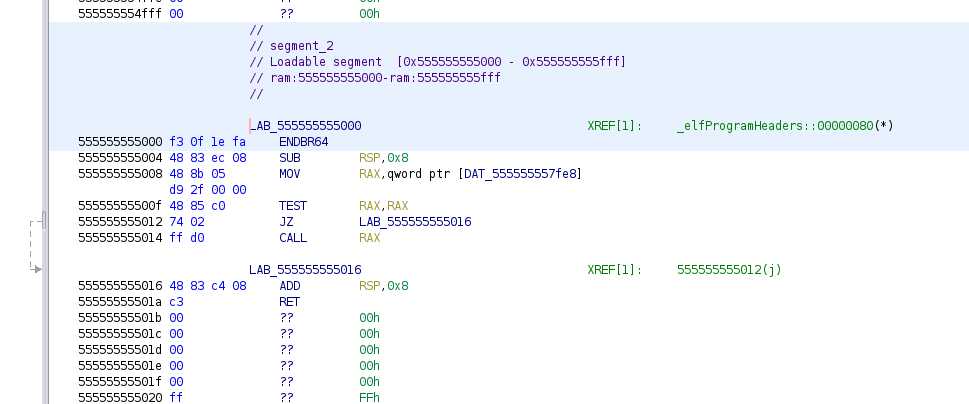
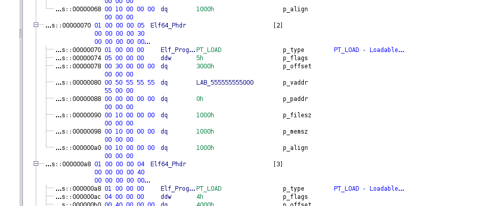

# Core Dumps

Core Dumps, is a type of ELF file that is supposed to provide debug info into a running ELF process. It contains the data of the segments, and the value of the registers. It will also contain a `PT_NOTE` section, with will contain metadata about the process.

## Enable Core Dumps

So core dumps are not enabled by default. Here is how you can enable them.

First off, we will establish the directory for coredumps to be stored at to be `/coredumps/`:

```
$ ls
core-try-11-1000-1000-28237-1702522468  readme.md  t  try  try.c  tt
$ sudo mkdir /coredumps/
$ sudo chmod 777 /coredumps/
$ sudo sysctl -w kernel.core_pattern=/coredumps/core-%e-%s-%u-%g-%p-%t
kernel.core_pattern = /coredumps/core-%e-%s-%u-%g-%p-%t
$ cat /proc/sys/kernel/core_pattern 
/coredumps/core-%e-%s-%u-%g-%p-%t
```

Next up, we will cause a segmentation fault, this will not create a coredump. That is because the core dump size we've specified is `0x00`:

```
$ ./try 
00000000000000000000000000000000000000000000000000000000000000000000000000000000000000000000000000000000000000000000000000000000000000000000000000000000000000
Test
Segmentation fault
$ ulimit -c
0
```

Let's change the size to `unlimited`:

```
$ ulimit -S -c unlimited
$ ulimit -c
unlimited
```

Let's now generate the coredump via a stack smash bug:

```
$ ls -asl /coredumps/
total 8
4 drwxrwxrwx  2  777 root 4096 Jan 27 20:53 .
4 drwxr-xr-x 23 root root 4096 Jan 27 20:53 ..
$ ./try 
000000000000000000000000000000000000000000000000000000000000000000000000000000000000000000000000000000000000000000000000000000000000000000000000000000000000000000000000000000000000
Test
Segmentation fault (core dumped)
$ ls /coredumps/
core-try-11-1000-1000-4934-1706406945
```

## Core Dump Analysis

So, let's actually generate a coredump file and look at it. First off, we will generate a coredump.

This coredump, will be of a simple stack smash bug, overwriting the Stack Canary.

```
$	ls
test  test.c
$  gdb ./test 
GNU gdb (Ubuntu 12.0.90-0ubuntu1) 12.0.90
Copyright (C) 2022 Free Software Foundation, Inc.
License GPLv3+: GNU GPL version 3 or later <http://gnu.org/licenses/gpl.html>
This is free software: you are free to change and redistribute it.
There is NO WARRANTY, to the extent permitted by law.
Type "show copying" and "show warranty" for details.
This GDB was configured as "x86_64-linux-gnu".
Type "show configuration" for configuration details.
For bug reporting instructions, please see:
<https://www.gnu.org/software/gdb/bugs/>.
Find the GDB manual and other documentation resources online at:
    <http://www.gnu.org/software/gdb/documentation/>.

For help, type "help".
Type "apropos word" to search for commands related to "word"...
GEF for linux ready, type `gef' to start, `gef config' to configure
89 commands loaded and 5 functions added for GDB 12.0.90 in 0.00ms using Python engine 3.10
dGEF for linux ready, type `gef' to start, `gef config' to configure
89 commands loaded and 5 functions added for GDB 12.0.90 in 0.00ms using Python engine 3.10
Reading symbols from ./test...
(No debugging symbols found in ./test)
gef➤  disas main
Dump of assembler code for function main:
   0x0000000000001189 <+0>:	endbr64 
   0x000000000000118d <+4>:	push   rbp
   0x000000000000118e <+5>:	mov    rbp,rsp
   0x0000000000001191 <+8>:	sub    rsp,0x10
   0x0000000000001195 <+12>:	mov    rax,QWORD PTR fs:0x28
   0x000000000000119e <+21>:	mov    QWORD PTR [rbp-0x8],rax
   0x00000000000011a2 <+25>:	xor    eax,eax
   0x00000000000011a4 <+27>:	lea    rax,[rbp-0xd]
   0x00000000000011a8 <+31>:	mov    rdi,rax
   0x00000000000011ab <+34>:	mov    eax,0x0
   0x00000000000011b0 <+39>:	call   0x1090 <gets@plt>
   0x00000000000011b5 <+44>:	lea    rax,[rip+0xe48]        # 0x2004
   0x00000000000011bc <+51>:	mov    rdi,rax
   0x00000000000011bf <+54>:	call   0x1070 <puts@plt>
   0x00000000000011c4 <+59>:	nop
   0x00000000000011c5 <+60>:	mov    rax,QWORD PTR [rbp-0x8]
   0x00000000000011c9 <+64>:	sub    rax,QWORD PTR fs:0x28
   0x00000000000011d2 <+73>:	je     0x11d9 <main+80>
   0x00000000000011d4 <+75>:	call   0x1080 <__stack_chk_fail@plt>
   0x00000000000011d9 <+80>:	leave  
   0x00000000000011da <+81>:	ret    
End of assembler dump.
gef➤  b *main+44
Breakpoint 1 at 0x11b5
gef➤  r
Starting program: /coredumps/test 
[Thread debugging using libthread_db enabled]
Using host libthread_db library "/lib/x86_64-linux-gnu/libthread_db.so.1".
0000000000000000000000000000000000000000000000000000000000000000000000000000000000000000

Breakpoint 1, 0x00005555555551b5 in main ()

[ Legend: Modified register | Code | Heap | Stack | String ]
────────────────────────────────────────────────────────────────────────────────────────── registers ────
$rax   : 0x00007fffffffe043  →  "00000000000000000000000000000000000000000000000000[...]"
$rbx   : 0x0               
$rcx   : 0x00007ffff7e1aaa0  →  0x00000000fbad2288
$rdx   : 0x1               
$rsp   : 0x00007fffffffe040  →  0x3030303030001000
$rbp   : 0x00007fffffffe050  →  "00000000000000000000000000000000000000000000000000[...]"
$rsi   : 0x1               
$rdi   : 0x00007ffff7e1ca80  →  0x0000000000000000
$rip   : 0x00005555555551b5  →  <main+44> lea rax, [rip+0xe48]        # 0x555555556004
$r8    : 0x0               
$r9    : 0x0               
$r10   : 0x77              
$r11   : 0x246             
$r12   : 0x00007fffffffe168  →  0x00007fffffffe48e  →  "/coredumps/test"
$r13   : 0x0000555555555189  →  <main+0> endbr64 
$r14   : 0x0000555555557db0  →  0x0000555555555140  →  <__do_global_dtors_aux+0> endbr64 
$r15   : 0x00007ffff7ffd040  →  0x00007ffff7ffe2e0  →  0x0000555555554000  →   jg 0x555555554047
$eflags: [zero carry PARITY adjust sign trap INTERRUPT direction overflow resume virtualx86 identification]
$cs: 0x33 $ss: 0x2b $ds: 0x00 $es: 0x00 $fs: 0x00 $gs: 0x00 
────────────────────────────────────────────────────────────────────────────────────────────── stack ────
0x00007fffffffe040│+0x0000: 0x3030303030001000	 ← $rsp
0x00007fffffffe048│+0x0008: "00000000000000000000000000000000000000000000000000[...]"
0x00007fffffffe050│+0x0010: "00000000000000000000000000000000000000000000000000[...]"	 ← $rbp
0x00007fffffffe058│+0x0018: "00000000000000000000000000000000000000000000000000[...]"
0x00007fffffffe060│+0x0020: "00000000000000000000000000000000000000000000000000[...]"
0x00007fffffffe068│+0x0028: "00000000000000000000000000000000000000000000000000[...]"
0x00007fffffffe070│+0x0030: "0000000000000000000000000000000000000000000"
0x00007fffffffe078│+0x0038: "00000000000000000000000000000000000"
──────────────────────────────────────────────────────────────────────────────────────── code:x86:64 ────
   0x5555555551a8 <main+31>        mov    rdi, rax
   0x5555555551ab <main+34>        mov    eax, 0x0
   0x5555555551b0 <main+39>        call   0x555555555090 <gets@plt>
 → 0x5555555551b5 <main+44>        lea    rax, [rip+0xe48]        # 0x555555556004
   0x5555555551bc <main+51>        mov    rdi, rax
   0x5555555551bf <main+54>        call   0x555555555070 <puts@plt>
   0x5555555551c4 <main+59>        nop    
   0x5555555551c5 <main+60>        mov    rax, QWORD PTR [rbp-0x8]
   0x5555555551c9 <main+64>        sub    rax, QWORD PTR fs:0x28
──────────────────────────────────────────────────────────────────────────────────────────── threads ────
[#0] Id 1, Name: "test", stopped 0x5555555551b5 in main (), reason: BREAKPOINT
────────────────────────────────────────────────────────────────────────────────────────────── trace ────
[#0] 0x5555555551b5 → main()
─────────────────────────────────────────────────────────────────────────────────────────────────────────


[ Legend: Modified register | Code | Heap | Stack | String ]
────────────────────────────────────────────────────────────────────────────────────────── registers ────
$rax   : 0x00007fffffffe043  →  "00000000000000000000000000000000000000000000000000[...]"
$rbx   : 0x0               
$rcx   : 0x00007ffff7e1aaa0  →  0x00000000fbad2288
$rdx   : 0x1               
$rsp   : 0x00007fffffffe040  →  0x3030303030001000
$rbp   : 0x00007fffffffe050  →  "00000000000000000000000000000000000000000000000000[...]"
$rsi   : 0x1               
$rdi   : 0x00007ffff7e1ca80  →  0x0000000000000000
$rip   : 0x00005555555551b5  →  <main+44> lea rax, [rip+0xe48]        # 0x555555556004
$r8    : 0x0               
$r9    : 0x0               
$r10   : 0x77              
$r11   : 0x246             
$r12   : 0x00007fffffffe168  →  0x00007fffffffe48e  →  "/coredumps/test"
$r13   : 0x0000555555555189  →  <main+0> endbr64 
$r14   : 0x0000555555557db0  →  0x0000555555555140  →  <__do_global_dtors_aux+0> endbr64 
$r15   : 0x00007ffff7ffd040  →  0x00007ffff7ffe2e0  →  0x0000555555554000  →   jg 0x555555554047
$eflags: [zero carry PARITY adjust sign trap INTERRUPT direction overflow resume virtualx86 identification]
$cs: 0x33 $ss: 0x2b $ds: 0x00 $es: 0x00 $fs: 0x00 $gs: 0x00 
────────────────────────────────────────────────────────────────────────────────────────────── stack ────
0x00007fffffffe040│+0x0000: 0x3030303030001000	 ← $rsp
0x00007fffffffe048│+0x0008: "00000000000000000000000000000000000000000000000000[...]"
0x00007fffffffe050│+0x0010: "00000000000000000000000000000000000000000000000000[...]"	 ← $rbp
0x00007fffffffe058│+0x0018: "00000000000000000000000000000000000000000000000000[...]"
0x00007fffffffe060│+0x0020: "00000000000000000000000000000000000000000000000000[...]"
0x00007fffffffe068│+0x0028: "00000000000000000000000000000000000000000000000000[...]"
0x00007fffffffe070│+0x0030: "0000000000000000000000000000000000000000000"
0x00007fffffffe078│+0x0038: "00000000000000000000000000000000000"
──────────────────────────────────────────────────────────────────────────────────────── code:x86:64 ────
   0x5555555551a8 <main+31>        mov    rdi, rax
   0x5555555551ab <main+34>        mov    eax, 0x0
   0x5555555551b0 <main+39>        call   0x555555555090 <gets@plt>
 → 0x5555555551b5 <main+44>        lea    rax, [rip+0xe48]        # 0x555555556004
   0x5555555551bc <main+51>        mov    rdi, rax
   0x5555555551bf <main+54>        call   0x555555555070 <puts@plt>
   0x5555555551c4 <main+59>        nop    
   0x5555555551c5 <main+60>        mov    rax, QWORD PTR [rbp-0x8]
   0x5555555551c9 <main+64>        sub    rax, QWORD PTR fs:0x28
──────────────────────────────────────────────────────────────────────────────────────────── threads ────
[#0] Id 1, Name: "test", stopped 0x5555555551b5 in main (), reason: BREAKPOINT
────────────────────────────────────────────────────────────────────────────────────────────── trace ────
[#0] 0x5555555551b5 → main()
─────────────────────────────────────────────────────────────────────────────────────────────────────────
gef➤  vmmap
[ Legend:  Code | Heap | Stack ]
Start              End                Offset             Perm Path
0x0000555555554000 0x0000555555555000 0x0000000000000000 r-- /coredumps/test
0x0000555555555000 0x0000555555556000 0x0000000000001000 r-x /coredumps/test
0x0000555555556000 0x0000555555557000 0x0000000000002000 r-- /coredumps/test
0x0000555555557000 0x0000555555558000 0x0000000000002000 r-- /coredumps/test
0x0000555555558000 0x0000555555559000 0x0000000000003000 rw- /coredumps/test
0x0000555555559000 0x000055555557a000 0x0000000000000000 rw- [heap]
0x00007ffff7c00000 0x00007ffff7c28000 0x0000000000000000 r-- /usr/lib/x86_64-linux-gnu/libc.so.6
0x00007ffff7c28000 0x00007ffff7dbd000 0x0000000000028000 r-x /usr/lib/x86_64-linux-gnu/libc.so.6
0x00007ffff7dbd000 0x00007ffff7e15000 0x00000000001bd000 r-- /usr/lib/x86_64-linux-gnu/libc.so.6
0x00007ffff7e15000 0x00007ffff7e16000 0x0000000000215000 --- /usr/lib/x86_64-linux-gnu/libc.so.6
0x00007ffff7e16000 0x00007ffff7e1a000 0x0000000000215000 r-- /usr/lib/x86_64-linux-gnu/libc.so.6
0x00007ffff7e1a000 0x00007ffff7e1c000 0x0000000000219000 rw- /usr/lib/x86_64-linux-gnu/libc.so.6
0x00007ffff7e1c000 0x00007ffff7e29000 0x0000000000000000 rw- 
0x00007ffff7fa3000 0x00007ffff7fa6000 0x0000000000000000 rw- 
0x00007ffff7fbb000 0x00007ffff7fbd000 0x0000000000000000 rw- 
0x00007ffff7fbd000 0x00007ffff7fc1000 0x0000000000000000 r-- [vvar]
0x00007ffff7fc1000 0x00007ffff7fc3000 0x0000000000000000 r-x [vdso]
0x00007ffff7fc3000 0x00007ffff7fc5000 0x0000000000000000 r-- /usr/lib/x86_64-linux-gnu/ld-linux-x86-64.so.2
0x00007ffff7fc5000 0x00007ffff7fef000 0x0000000000002000 r-x /usr/lib/x86_64-linux-gnu/ld-linux-x86-64.so.2
0x00007ffff7fef000 0x00007ffff7ffa000 0x000000000002c000 r-- /usr/lib/x86_64-linux-gnu/ld-linux-x86-64.so.2
0x00007ffff7ffb000 0x00007ffff7ffd000 0x0000000000037000 r-- /usr/lib/x86_64-linux-gnu/ld-linux-x86-64.so.2
0x00007ffff7ffd000 0x00007ffff7fff000 0x0000000000039000 rw- /usr/lib/x86_64-linux-gnu/ld-linux-x86-64.so.2
0x00007ffffffde000 0x00007ffffffff000 0x0000000000000000 rw- [stack]
0xffffffffff600000 0xffffffffff601000 0x0000000000000000 --x [vsyscall]
gef➤  x/100g 0x0000555555555000
0x555555555000 <_init>:	0x8ec8348fa1e0ff3	0x4800002fd9058b48
0x555555555010 <_init+16>:	0x8348d0ff0274c085	0xc308c4
0x555555555020:	0xfff200002f8a35ff	0x1f0f00002f8b25
0x555555555030:	0x68fa1e0ff3	0x90ffffffe1e9f200
0x555555555040:	0x168fa1e0ff3	0x90ffffffd1e9f200
0x555555555050:	0x268fa1e0ff3	0x90ffffffc1e9f200
0x555555555060 <__cxa_finalize@plt>:	0x8d25fff2fa1e0ff3	0x441f0f00002f
0x555555555070 <puts@plt>:	0x4525fff2fa1e0ff3	0x441f0f00002f
0x555555555080 <__stack_chk_fail@plt>:	0x3d25fff2fa1e0ff3	0x441f0f00002f
0x555555555090 <gets@plt>:	0x3525fff2fa1e0ff3	0x441f0f00002f
0x5555555550a0 <_start>:	0x8949ed31fa1e0ff3	0xe48348e289485ed1
0x5555555550b0 <_start+16>:	0xc931c031455450f0	0xff000000ca3d8d48
0x5555555550c0 <_start+32>:	0x2e66f400002f1315	0x841f0f
0x5555555550d0 <deregister_tm_clones>:	0x4800002f393d8d48	0x394800002f32058d
0x5555555550e0 <deregister_tm_clones+16>:	0x2ef6058b481574f8	0xff0974c085480000
0x5555555550f0 <deregister_tm_clones+32>:	0x801f0fe0	0x801f0fc3
0x555555555100 <register_tm_clones>:	0x4800002f093d8d48	0x294800002f02358d
0x555555555110 <register_tm_clones+16>:	0x3feec148f08948fe	0x48c6014803f8c148
0x555555555120 <register_tm_clones+32>:	0xc5058b481474fed1	0x874c0854800002e
0x555555555130 <register_tm_clones+48>:	0x441f0f66e0ff	0x801f0fc3
0x555555555140 <__do_global_dtors_aux>:	0x2ec53d80fa1e0ff3	0x8348552b75000000
0x555555555150 <__do_global_dtors_aux+16>:	0x89480000002ea23d	0x2ea63d8b480c74e5
0x555555555160 <__do_global_dtors_aux+32>:	0xe8fffffef9e80000	0x2e9d05c6ffffff64
0x555555555170 <__do_global_dtors_aux+48>:	0x1f0fc35d010000	0x801f0fc3
0x555555555180 <frame_dummy>:	0xffff77e9fa1e0ff3	0x894855fa1e0ff3ff
0x555555555190 <main+7>:	0x8b486410ec8348e5	0x8948000000282504
0x5555555551a0 <main+23>:	0xf3458d48c031f845	0xb8c78948
0x5555555551b0 <main+39>:	0x58d48fffffedbe8	0xe8c7894800000e48
0x5555555551c0 <main+55>:	0x458b4890fffffeac	0x2825042b4864f8
0x5555555551d0 <main+71>:	0xfffea7e805740000	0xfa1e0ff300c3c9ff
0x5555555551e0 <_fini+4>:	0x8c4834808ec8348	0xc3
0x5555555551f0:	0x0	0x0
0x555555555200:	0x0	0x0
0x555555555210:	0x0	0x0
0x555555555220:	0x0	0x0
0x555555555230:	0x0	0x0
0x555555555240:	0x0	0x0
0x555555555250:	0x0	0x0
0x555555555260:	0x0	0x0
0x555555555270:	0x0	0x0
0x555555555280:	0x0	0x0
0x555555555290:	0x0	0x0
0x5555555552a0:	0x0	0x0
0x5555555552b0:	0x0	0x0
0x5555555552c0:	0x0	0x0
0x5555555552d0:	0x0	0x0
0x5555555552e0:	0x0	0x0
0x5555555552f0:	0x0	0x0
0x555555555300:	0x0	0x0
0x555555555310:	0x0	0x0
gef➤  c
Continuing.
Test
*** stack smashing detected ***: terminated

Program received signal SIGABRT, Aborted.
__pthread_kill_implementation (no_tid=0x0, signo=0x6, threadid=0x7ffff7fa3740) at ./nptl/pthread_kill.c:44
44	./nptl/pthread_kill.c: No such file or directory.

[ Legend: Modified register | Code | Heap | Stack | String ]
────────────────────────────────────────────────────────────────────────────────────────── registers ────
$rax   : 0x0               
$rbx   : 0x00007ffff7fa3740  →  0x00007ffff7fa3740  →  [loop detected]
$rcx   : 0x00007ffff7c969fc  →  <pthread_kill+300> mov r13d, eax
$rdx   : 0x6               
$rsp   : 0x00007fffffffdcc0  →  0x00007ffff7fbb160  →  0x00007ffff7c00000  →  0x03010102464c457f
$rbp   : 0x4fbd            
$rsi   : 0x4fbd            
$rdi   : 0x4fbd            
$rip   : 0x00007ffff7c969fc  →  <pthread_kill+300> mov r13d, eax
$r8    : 0x00007fffffffdd90  →  0x0000000000000020 (" "?)
$r9    : 0x0               
$r10   : 0x8               
$r11   : 0x246             
$r12   : 0x6               
$r13   : 0x16              
$r14   : 0x2               
$r15   : 0x1               
$eflags: [ZERO carry PARITY adjust sign trap INTERRUPT direction overflow resume virtualx86 identification]
$cs: 0x33 $ss: 0x2b $ds: 0x00 $es: 0x00 $fs: 0x00 $gs: 0x00 
────────────────────────────────────────────────────────────────────────────────────────────── stack ────
0x00007fffffffdcc0│+0x0000: 0x00007ffff7fbb160  →  0x00007ffff7c00000  →  0x03010102464c457f	 ← $rsp
0x00007fffffffdcc8│+0x0008: 0x00007ffff7e1a1b8  →  0x00007ffff7fde660  →  <_dl_audit_preinit+0> endbr64 
0x00007fffffffdcd0│+0x0010: 0x0000555555555189  →  <main+0> endbr64 
0x00007fffffffdcd8│+0x0018: 0x0000555555557db0  →  0x0000555555555140  →  <__do_global_dtors_aux+0> endbr64 
0x00007fffffffdce0│+0x0020: 0x00007ffff7ffd040  →  0x00007ffff7ffe2e0  →  0x0000555555554000  →   jg 0x555555554047
0x00007fffffffdce8│+0x0028: 0x00007ffff7d1a8f4  →  <sbrk+148> test eax, eax
0x00007fffffffdcf0│+0x0030: 0x00007ffff7e1ac80  →  0x0000000000000000
0x00007fffffffdcf8│+0x0038: 0x0000000000000290
──────────────────────────────────────────────────────────────────────────────────────── code:x86:64 ────
   0x7ffff7c969f3 <pthread_kill+291> mov    edi, eax
   0x7ffff7c969f5 <pthread_kill+293> mov    eax, 0xea
   0x7ffff7c969fa <pthread_kill+298> syscall 
 → 0x7ffff7c969fc <pthread_kill+300> mov    r13d, eax
   0x7ffff7c969ff <pthread_kill+303> neg    r13d
   0x7ffff7c96a02 <pthread_kill+306> cmp    eax, 0xfffff000
   0x7ffff7c96a07 <pthread_kill+311> mov    eax, 0x0
   0x7ffff7c96a0c <pthread_kill+316> cmovbe r13d, eax
   0x7ffff7c96a10 <pthread_kill+320> jmp    0x7ffff7c96982 <__GI___pthread_kill+178>
──────────────────────────────────────────────────────────────────────────────────────────── threads ────
[#0] Id 1, Name: "test", stopped 0x7ffff7c969fc in __pthread_kill_implementation (), reason: SIGABRT
────────────────────────────────────────────────────────────────────────────────────────────── trace ────
[#0] 0x7ffff7c969fc → __pthread_kill_implementation(no_tid=0x0, signo=0x6, threadid=0x7ffff7fa3740)
[#1] 0x7ffff7c969fc → __pthread_kill_internal(signo=0x6, threadid=0x7ffff7fa3740)
[#2] 0x7ffff7c969fc → __GI___pthread_kill(threadid=0x7ffff7fa3740, signo=0x6)
[#3] 0x7ffff7c42476 → __GI_raise(sig=0x6)
[#4] 0x7ffff7c287f3 → __GI_abort()
[#5] 0x7ffff7c89676 → __libc_message(action=do_abort, fmt=0x7ffff7ddb92e "*** %s ***: terminated\n")
[#6] 0x7ffff7d3659a → __GI___fortify_fail(msg=0x7ffff7ddb916 "stack smashing detected")
[#7] 0x7ffff7d36566 → __stack_chk_fail()
[#8] 0x5555555551d9 → main()
─────────────────────────────────────────────────────────────────────────────────────────────────────────

[ Legend: Modified register | Code | Heap | Stack | String ]
────────────────────────────────────────────────────────────────────────────────────────── registers ────
$rax   : 0x0               
$rbx   : 0x00007ffff7fa3740  →  0x00007ffff7fa3740  →  [loop detected]
$rcx   : 0x00007ffff7c969fc  →  <pthread_kill+300> mov r13d, eax
$rdx   : 0x6               
$rsp   : 0x00007fffffffdcc0  →  0x00007ffff7fbb160  →  0x00007ffff7c00000  →  0x03010102464c457f
$rbp   : 0x4fbd            
$rsi   : 0x4fbd            
$rdi   : 0x4fbd            
$rip   : 0x00007ffff7c969fc  →  <pthread_kill+300> mov r13d, eax
$r8    : 0x00007fffffffdd90  →  0x0000000000000020 (" "?)
$r9    : 0x0               
$r10   : 0x8               
$r11   : 0x246             
$r12   : 0x6               
$r13   : 0x16              
$r14   : 0x2               
$r15   : 0x1               
$eflags: [ZERO carry PARITY adjust sign trap INTERRUPT direction overflow resume virtualx86 identification]
$cs: 0x33 $ss: 0x2b $ds: 0x00 $es: 0x00 $fs: 0x00 $gs: 0x00 
────────────────────────────────────────────────────────────────────────────────────────────── stack ────
0x00007fffffffdcc0│+0x0000: 0x00007ffff7fbb160  →  0x00007ffff7c00000  →  0x03010102464c457f	 ← $rsp
0x00007fffffffdcc8│+0x0008: 0x00007ffff7e1a1b8  →  0x00007ffff7fde660  →  <_dl_audit_preinit+0> endbr64 
0x00007fffffffdcd0│+0x0010: 0x0000555555555189  →  <main+0> endbr64 
0x00007fffffffdcd8│+0x0018: 0x0000555555557db0  →  0x0000555555555140  →  <__do_global_dtors_aux+0> endbr64 
0x00007fffffffdce0│+0x0020: 0x00007ffff7ffd040  →  0x00007ffff7ffe2e0  →  0x0000555555554000  →   jg 0x555555554047
0x00007fffffffdce8│+0x0028: 0x00007ffff7d1a8f4  →  <sbrk+148> test eax, eax
0x00007fffffffdcf0│+0x0030: 0x00007ffff7e1ac80  →  0x0000000000000000
0x00007fffffffdcf8│+0x0038: 0x0000000000000290
──────────────────────────────────────────────────────────────────────────────────────── code:x86:64 ────
   0x7ffff7c969f3 <pthread_kill+291> mov    edi, eax
   0x7ffff7c969f5 <pthread_kill+293> mov    eax, 0xea
   0x7ffff7c969fa <pthread_kill+298> syscall 
 → 0x7ffff7c969fc <pthread_kill+300> mov    r13d, eax
   0x7ffff7c969ff <pthread_kill+303> neg    r13d
   0x7ffff7c96a02 <pthread_kill+306> cmp    eax, 0xfffff000
   0x7ffff7c96a07 <pthread_kill+311> mov    eax, 0x0
   0x7ffff7c96a0c <pthread_kill+316> cmovbe r13d, eax
   0x7ffff7c96a10 <pthread_kill+320> jmp    0x7ffff7c96982 <__GI___pthread_kill+178>
──────────────────────────────────────────────────────────────────────────────────────────── threads ────
[#0] Id 1, Name: "test", stopped 0x7ffff7c969fc in __pthread_kill_implementation (), reason: SIGABRT
────────────────────────────────────────────────────────────────────────────────────────────── trace ────
[#0] 0x7ffff7c969fc → __pthread_kill_implementation(no_tid=0x0, signo=0x6, threadid=0x7ffff7fa3740)
[#1] 0x7ffff7c969fc → __pthread_kill_internal(signo=0x6, threadid=0x7ffff7fa3740)
[#2] 0x7ffff7c969fc → __GI___pthread_kill(threadid=0x7ffff7fa3740, signo=0x6)
[#3] 0x7ffff7c42476 → __GI_raise(sig=0x6)
[#4] 0x7ffff7c287f3 → __GI_abort()
[#5] 0x7ffff7c89676 → __libc_message(action=do_abort, fmt=0x7ffff7ddb92e "*** %s ***: terminated\n")
[#6] 0x7ffff7d3659a → __GI___fortify_fail(msg=0x7ffff7ddb916 "stack smashing detected")
[#7] 0x7ffff7d36566 → __stack_chk_fail()
[#8] 0x5555555551d9 → main()
─────────────────────────────────────────────────────────────────────────────────────────────────────────
gef➤  c
Continuing.

Program terminated with signal SIGABRT, Aborted.
The program no longer exists.
gef➤  q
guy@tux:/coredumps$ ls
core-test-6-1000-1000-20413-1706668190  test  test.c
```

So, we've generated the coredump. We see the data at `0x555555555000` is `0x8ec8348fa1e0ff3`. We will be able to see that same data in the coredump, when we analyze it at that address. We see that in ghidra right here:



The core dump file has the data that belongs there, since a copy of it is saved in the Core Dump file itself. The addresses it has, are from the Program Header Table entry. We see the PHT entry for the segment, which the `0x555555555000` address resides in here:



We can also see this information with `readelf`:

```
$	readelf -a core-test-6-1000-1000-20413-1706668190 
ELF Header:
  Magic:   7f 45 4c 46 02 01 01 00 00 00 00 00 00 00 00 00 
  Class:                             ELF64
  Data:                              2's complement, little endian
  Version:                           1 (current)
  OS/ABI:                            UNIX - System V
  ABI Version:                       0
  Type:                              CORE (Core file)
  Machine:                           Advanced Micro Devices X86-64
  Version:                           0x1
  Entry point address:               0x0
  Start of program headers:          64 (bytes into file)
  Start of section headers:          0 (bytes into file)
  Flags:                             0x0
  Size of this header:               64 (bytes)
  Size of program headers:           56 (bytes)
  Number of program headers:         26
  Size of section headers:           0 (bytes)
  Number of section headers:         0
  Section header string table index: 0

There are no sections in this file.

There are no section groups in this file.

Program Headers:
  Type           Offset             VirtAddr           PhysAddr
                 FileSiz            MemSiz              Flags  Align
  NOTE           0x00000000000005f0 0x0000000000000000 0x0000000000000000
                 0x0000000000000d38 0x0000000000000000         0x4
  LOAD           0x0000000000002000 0x0000555555554000 0x0000000000000000
                 0x0000000000001000 0x0000000000001000  R      0x1000
  LOAD           0x0000000000003000 0x0000555555555000 0x0000000000000000
                 0x0000000000001000 0x0000000000001000  R E    0x1000
  LOAD           0x0000000000004000 0x0000555555556000 0x0000000000000000
                 0x0000000000000000 0x0000000000001000  R      0x1000
  LOAD           0x0000000000004000 0x0000555555557000 0x0000000000000000
                 0x0000000000001000 0x0000000000001000  R      0x1000
  LOAD           0x0000000000005000 0x0000555555558000 0x0000000000000000
                 0x0000000000001000 0x0000000000001000  RW     0x1000
  LOAD           0x0000000000006000 0x0000555555559000 0x0000000000000000
                 0x0000000000021000 0x0000000000021000  RW     0x1000
  LOAD           0x0000000000027000 0x00007ffff7c00000 0x0000000000000000
                 0x0000000000001000 0x0000000000028000  R      0x1000
  LOAD           0x0000000000028000 0x00007ffff7c28000 0x0000000000000000
                 0x0000000000000000 0x0000000000195000  R E    0x1000
  LOAD           0x0000000000028000 0x00007ffff7dbd000 0x0000000000000000
                 0x0000000000000000 0x0000000000058000  R      0x1000
  LOAD           0x0000000000028000 0x00007ffff7e15000 0x0000000000000000
                 0x0000000000000000 0x0000000000001000         0x1000
  LOAD           0x0000000000028000 0x00007ffff7e16000 0x0000000000000000
                 0x0000000000004000 0x0000000000004000  R      0x1000
  LOAD           0x000000000002c000 0x00007ffff7e1a000 0x0000000000000000
                 0x0000000000002000 0x0000000000002000  RW     0x1000
  LOAD           0x000000000002e000 0x00007ffff7e1c000 0x0000000000000000
                 0x000000000000d000 0x000000000000d000  RW     0x1000
  LOAD           0x000000000003b000 0x00007ffff7fa3000 0x0000000000000000
                 0x0000000000003000 0x0000000000003000  RW     0x1000
  LOAD           0x000000000003e000 0x00007ffff7fbb000 0x0000000000000000
                 0x0000000000002000 0x0000000000002000  RW     0x1000
  LOAD           0x0000000000040000 0x00007ffff7fbd000 0x0000000000000000
                 0x0000000000004000 0x0000000000004000  R      0x1000
  LOAD           0x0000000000044000 0x00007ffff7fc1000 0x0000000000000000
                 0x0000000000002000 0x0000000000002000  R E    0x1000
  LOAD           0x0000000000046000 0x00007ffff7fc3000 0x0000000000000000
                 0x0000000000001000 0x0000000000002000  R      0x1000
  LOAD           0x0000000000047000 0x00007ffff7fc5000 0x0000000000000000
                 0x000000000002a000 0x000000000002a000  R E    0x1000
  LOAD           0x0000000000071000 0x00007ffff7fef000 0x0000000000000000
                 0x0000000000000000 0x000000000000b000  R      0x1000
  LOAD           0x0000000000071000 0x00007ffff7ffa000 0x0000000000000000
                 0x0000000000001000 0x0000000000001000  RW     0x1000
  LOAD           0x0000000000072000 0x00007ffff7ffb000 0x0000000000000000
                 0x0000000000002000 0x0000000000002000  R      0x1000
  LOAD           0x0000000000074000 0x00007ffff7ffd000 0x0000000000000000
                 0x0000000000002000 0x0000000000002000  RW     0x1000
  LOAD           0x0000000000076000 0x00007ffffffde000 0x0000000000000000
                 0x0000000000021000 0x0000000000021000  RW     0x1000
  LOAD           0x0000000000097000 0xffffffffff600000 0x0000000000000000
                 0x0000000000001000 0x0000000000001000    E    0x1000

There is no dynamic section in this file.

There are no relocations in this file.
No processor specific unwind information to decode

Dynamic symbol information is not available for displaying symbols.

No version information found in this file.

Displaying notes found at file offset 0x000005f0 with length 0x00000d38:
  Owner                Data size 	Description
  CORE                 0x00000150	NT_PRSTATUS (prstatus structure)
  CORE                 0x00000088	NT_PRPSINFO (prpsinfo structure)
  CORE                 0x00000080	NT_SIGINFO (siginfo_t data)
  CORE                 0x00000170	NT_AUXV (auxiliary vector)
  CORE                 0x000003a3	NT_FILE (mapped files)
    Page size: 4096
                 Start                 End         Page Offset
    0x0000555555554000  0x0000555555555000  0x0000000000000000
        /coredumps/test
    0x0000555555555000  0x0000555555556000  0x0000000000000001
        /coredumps/test
    0x0000555555556000  0x0000555555557000  0x0000000000000002
        /coredumps/test
    0x0000555555557000  0x0000555555558000  0x0000000000000002
        /coredumps/test
    0x0000555555558000  0x0000555555559000  0x0000000000000003
        /coredumps/test
    0x00007ffff7c00000  0x00007ffff7c28000  0x0000000000000000
        /usr/lib/x86_64-linux-gnu/libc.so.6
    0x00007ffff7c28000  0x00007ffff7dbd000  0x0000000000000028
        /usr/lib/x86_64-linux-gnu/libc.so.6
    0x00007ffff7dbd000  0x00007ffff7e15000  0x00000000000001bd
        /usr/lib/x86_64-linux-gnu/libc.so.6
    0x00007ffff7e15000  0x00007ffff7e16000  0x0000000000000215
        /usr/lib/x86_64-linux-gnu/libc.so.6
    0x00007ffff7e16000  0x00007ffff7e1a000  0x0000000000000215
        /usr/lib/x86_64-linux-gnu/libc.so.6
    0x00007ffff7e1a000  0x00007ffff7e1c000  0x0000000000000219
        /usr/lib/x86_64-linux-gnu/libc.so.6
    0x00007ffff7fc3000  0x00007ffff7fc5000  0x0000000000000000
        /usr/lib/x86_64-linux-gnu/ld-linux-x86-64.so.2
    0x00007ffff7fc5000  0x00007ffff7fef000  0x0000000000000002
        /usr/lib/x86_64-linux-gnu/ld-linux-x86-64.so.2
    0x00007ffff7fef000  0x00007ffff7ffa000  0x000000000000002c
        /usr/lib/x86_64-linux-gnu/ld-linux-x86-64.so.2
    0x00007ffff7ffb000  0x00007ffff7ffd000  0x0000000000000037
        /usr/lib/x86_64-linux-gnu/ld-linux-x86-64.so.2
    0x00007ffff7ffd000  0x00007ffff7fff000  0x0000000000000039
        /usr/lib/x86_64-linux-gnu/ld-linux-x86-64.so.2
  CORE                 0x00000200	NT_FPREGSET (floating point registers)
  LINUX                0x00000340	NT_X86_XSTATE (x86 XSAVE extended state)
   description data: 7f 03 00 00 00 00 00 00 00 00 00 00 00 00 00 00 00 00 00 00 00 00 00 00 80 1f 00 00 ff ff 02 00 00 00 00 00 00 00 00 00 00 00 00 00 00 00 00 00 00 00 00 00 00 00 00 00 00 00 00 00 00 00 00 00 00 00 00 00 00 00 00 00 00 00 00 00 00 00 00 00 00 00 00 00 00 00 00 00 00 00 00 00 00 00 00 00 00 00 00 00 00 00 00 00 00 00 00 00 00 00 00 00 00 00 00 00 00 00 00 00 00 00 00 00 00 00 00 00 00 00 00 00 00 00 00 00 00 00 00 00 00 00 00 00 00 00 00 00 00 00 00 00 00 00 00 00 00 00 00 00 20 2a 2a 2a 3a 20 74 65 72 6d 69 6e 61 74 65 64 2a 2a 2a 3a 20 74 65 72 6d 69 6e 61 74 65 64 0a 00 00 00 00 00 00 00 00 00 00 00 00 00 00 00 00 30 30 30 30 30 30 30 30 30 30 30 30 30 30 30 30 2f 2f 2f 2f 2f 2f 2f 2f 2f 2f 2f 2f 2f 2f 2f 2f 98 0d 00 00 00 00 00 00 00 00 00 00 00 00 00 00 60 00 00 00 00 00 00 00 00 00 00 00 00 00 00 00 01 00 00 00 00 00 00 00 00 00 00 00 00 00 00 00 2a 2a 2a 3a 20 74 65 72 6d 69 6e 61 74 65 64 0a 00 00 00 00 00 00 00 00 00 00 00 00 00 00 00 00 00 00 00 00 00 00 00 00 00 00 00 00 00 00 00 00 00 00 00 00 00 00 00 00 00 00 00 00 00 00 00 00 00 00 00 00 00 00 00 00 00 00 00 00 00 00 00 00 00 00 00 00 00 00 00 00 00 00 00 00 00 00 00 00 00 00 00 00 00 00 00 00 00 00 00 00 00 00 00 00 00 00 00 00 00 00 00 00 00 00 00 00 00 00 00 00 00 00 00 00 00 00 00 00 00 00 00 00 00 00 00 00 00 00 00 00 00 00 00 00 00 00 00 00 00 00 00 00 00 00 00 00 00 00 00 00 00 00 00 00 00 00 00 00 07 00 00 00 00 00 00 00 00 00 00 00 00 00 00 00 00 00 00 00 00 00 00 00 00 00 00 00 00 00 00 00 00 00 00 00 00 00 00 00 00 00 00 00 00 00 00 00 02 00 00 00 00 00 00 00 00 00 00 00 00 00 00 00 00 00 00 00 00 00 00 00 00 00 00 00 00 00 00 00 00 00 00 00 00 00 00 00 00 00 00 00 00 00 00 00 00 00 00 00 00 00 00 00 00 00 00 00 00 00 00 00 00 00 00 00 00 00 00 00 00 00 00 00 00 00 00 00 00 00 00 00 00 00 00 00 00 00 00 00 00 00 00 00 00 00 00 00 00 00 00 00 00 00 00 00 00 00 00 00 00 00 00 00 00 00 00 00 00 00 00 00 00 00 00 00 00 00 00 00 00 00 00 00 00 00 00 00 00 00 00 00 00 00 00 00 00 00 00 00 00 00 00 00 00 00 00 00 00 00 00 00 00 00 00 00 00 00 00 00 00 00 00 00 00 00 00 00 00 00 00 00 00 00 00 00 00 00 00 00 00 00 00 00 00 00 00 00 00 00 00 00 00 00 00 00 00 00 00 00 00 00 00 00 00 00 00 00 00 00 00 00 00 00 00 00 00 00 00 00 00 00 00 00 00 00 00 00 00 00 00 00 00 00 00 00 00 00 00 00 00 00 00 00 00 00 00 00 00 00 00 00 00 00 00 00 00 00 00 00 00 00 00 00 00 00 00 00 00 00 00 00 00 00 00 00 00 00 00 00 00 00 00 00 00 00 00 00 00 00 00 00 00 00 00 00 00 00 00 00 00 00 00 00 00 00 00 00 
```

So we see the type of information a coredump file has, and how the coredump file models it.
