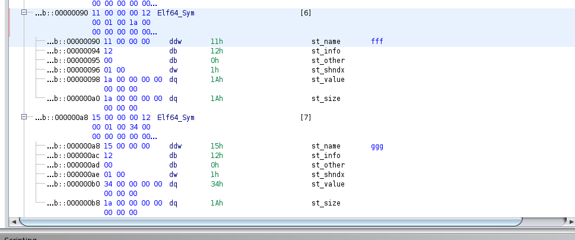

# Imports / Exports

This is based off of: http://www.m4b.io/elf/export/binary/analysis/2015/05/25/what-is-an-elf-export.html

So, I touched on this in some of my earlier documentation, but I wanted to come out and exactly define what imports / exports are, and how they are modeled in the elf.

So first, what are imports/exports. They are meant to model a piece of data, be it a string, integer, or function that is supposed to execute. Imports are used to model pieces of data that the elf will import from other elfs. Exports are used to model pieces of data, that the elf will export to other elfs. A piece of data that one elf exports, can be imported by another elf.

An elf will speicify imports and exports via symbols. 

A symbol will be an export, if it has certain characteristics. First off, the symbol has to have a defined value and the `st_info` field (a non-zero value). In addition to this, the `st_shndx` field should not be `0`. Since it is an export, the data the symbol is exporting should actually exist and be in some section. In addition to that the symbol has been marked with the `STB_GLOBAL` or `STB_WEAk` flag in the `st_type` field (meaning other elfs can access the symbol, although `weak` symbols can be overwritten by other symbols). In addition to that, the `st_type` field must fall within certain types. Lastly, the symbol should be present in the `.symtab` section array table.

Imports on the other hand, are meant to import data from other elf image files, that is not present in the elf image file with the import. As such, the `st_info` and `st_shndx` fields should be both `0`. The `st_name` field should not be `0`, because the name is what uniquely identifies what data to import. The `st_bind` needs to be either global or weak, since it has to access other object elf image files in order to get the data. The `st_type` needs to fall within certain ranges. Lastly, the symbol should be present in the `.symtab` section array table.

To sum it all up. Imports/exports are all symbols. To be an exported symbol:

*	The symbol's `st_value` field must not be 0
*	The symbol's `st_shndx` field must not be 0
*	The symbol's `st_bind` must either be weak or global
*	The symbol's `st_type` must either be `STT_FUNC`, `STT_IFUNC`, or `STT_OBJECT`
*	The symbol must be present in the `.symtab` section array

To be an imported symbol:

*	The symbol's `st_value` field must be 0
*	The symbol's `st_shndx` field must be 0
*	The symbol's `st_name` filed must not be 0
*	The symbol's `st_bind` must either be weak or global
*	The symbol's `st_type` must either be `STT_FUNC`, `STT_IFUNC`, or `STT_OBJECT`
*	The symbol must be present in the `.symtab` section array

Here we see some examples listed of imports/exports

Here we see the Imports:

And Here we see the Exports:

