# Relocations

So, what is a relocation. A relocation basically says "this piece of data will get written to this location". Another way to look at it, is "this piece of data will get relocated to this location".

So, elf files have symbols as we've discussed. At compile time, it may not actually know what the value is of certain symbols. For instance, let's say you have a dynamically linked elf binary, that uses the libc `puts` function. Now the elf executable, will have a spot to store the libc address of `puts` (because it is dynamically linked, the actual code for `puts` won't be stored in the elf binary, and thus the address of `puts` won't be known until it is dynamically linked at runtime). Now the executable will have a plt function for `puts`, which will effectively just take the libc address of `puts` stored at that spot, and jump to it. This plt function is what is used by the compiler to call `puts`.

Now for that, a relocation would be to write the libc address of `puts`, to the got entry (where the plt function expects the address to be). The value being written, will be tied to a symbol. The symbol for this example would be `puts`, and it's value would get filled in when it is dynamically linked at runtime. This is one example of a relocation.

Now let's discuss the datastructure used to actually model a relocation. There are two types of relocations, typically called either `rel` or `rela`. The only difference between the two, is `rela` has an extra `r_addend` field at the end (`rel` only has two fields). Relocations are stored in typically either `.rel` sections (for `rel` entries) or `.rela` sections (for `rela` entries). In addition to that, there might be an additional suffix to the section name, to specify what the sections should be for. For example, the `.rela.plt` section contains `rela` relocations for the `plt`.

Now in the `.rel/.rela` sections, it would contain a table of individual entries, where each entry is either a `rel/rela` relocation. Below, is the actual datastructure of those entries. They vary from `32/64` bit architectures (primary difference being size of the fields). This was copied from `https://docs.oracle.com/cd/E23824_01/html/819-0690/chapter6-54839.html`:

```
typedef struct {
	Elf32_Addr	r_offset;
	Elf32_Word	r_info;
} Elf32_Rel;

typedef struct {
	Elf32_Addr	r_offset;
	Elf32_Word	r_info;
	Elf32_Sword	r_addend;
} Elf32_Rela;

typedef struct {
	Elf64_Addr	r_offset;
	Elf64_Xword	r_info;
} Elf64_Rel;

typedef struct {
	Elf64_Addr	r_offset;
	Elf64_Xword	r_info;
	Elf64_Sxword	r_addend;
} Elf64_Rela;
```

So, let's go through each field. We can see, the primary difference between `32` and `64` bit, is the size of the fields.

## r_offset

So, the purpose of this field is to specify where the relocation is supposed to write the data to.

What this value means exactly, depends on what type of ELF file this is. The ELF file type is determined by the `e_type`  field in the ELF Header.

If the `e_type` value is `ET_EXEC`, the elf is an executable file. The `r_offset` field refers to the virtual address, at which the relocation should write the symbol value.

If the `e_type` value is `ET_REL`, the elf is a relocatable file (`.o` object file). The `r_offset` refers to the offset, from the start of a section in which to write the symbol value to. The section which this value serves as the offset to, is symbolized by the suffix name of the section. For example, if the section name is `.rela.text`, the offsets will be from the start of the `.text` section.

## r_info

Now this field, will specify two seperate things. The first, is which symbol whose value will serve as the source for the relocation write. The second, is what type of relocation this relocation is.

Now, in order to get these two things, you will perform binary operations agains the `r_info`. This was also copied from `https://intezer.com/blog/malware-analysis/executable-and-linkable-format-101-part-3-relocations/`:

```
ELF32_R_SYM(info) ((info)>>8)
ELF32_R_TYPE(info) ((unsigned char)(info))
ELF64_R_SYM(info) ((info)>>32)
ELF64_R_TYPE(info) ((Elf64_Word)(info))
```

For `32` bit ELFs, the lower `8` bits are the symbol type. For `64` bit ELFs, the lower `32` bits are the symbol type. The higher leftover bits in both cases, will be the symbol index.

The symbol index, is an integer value. It will be an index into a symbol table, where the index corresponds to the symbol whose value will be the source. To know what symbol table the index is for, you will have to look at the section header table entry for the `.rel/.rela` section where the relocation is stored. When you look at the `sh_link` field, it will contain the index into the seciton header table where the symbol table is. A relocation section will always have the `sh_link` field set in it's section header table entry, to the corresponding symbol table.

## r_addend

This field is a constant value, that is used to help calculate the value to be stored by the relocation. Exactly how this value is used, depends on the relocation type.

# Relocation Examples

So, let's take a look at some relocations. We will be looking at relocations, both from an executable and relocatable (`.o`) file.

## Executable File Relocations

So for this, we will be looking at the `.rela.plt` section. We see two seperate relocations here. The two relocations are to virtual addresses `0x3fc8` and `0x3fd0` (`0x00103fc8` and `0x00103fd0` with ghidra basing the binary at `0x00100000`). We also see that the symbol indices are `0x3` (`0x3fc8`) and `0x5` (`0x3fd0`):

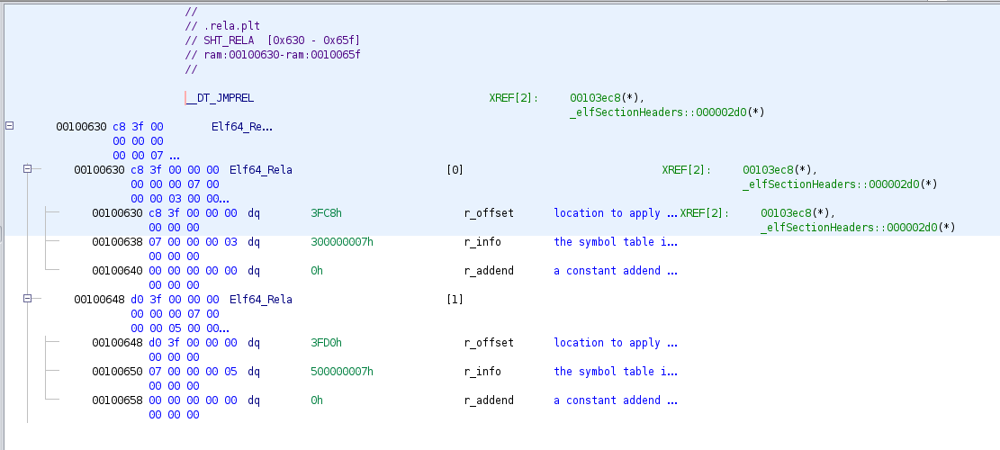

Taking a loot at the section header table entry for the `.rela.plt` section, we see it's `sh_link` value is `6`:

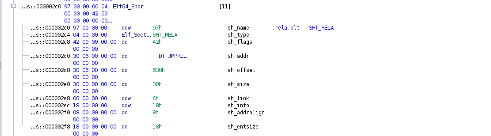

Which we see, the corresponding symbol table section is `.dynsym`:

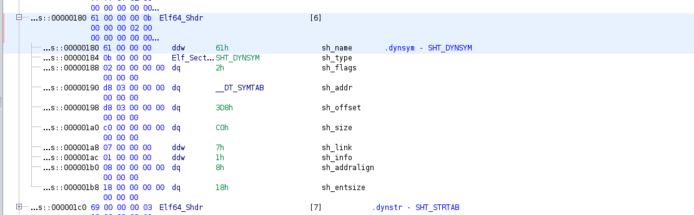

Looking at the `.dynsym` section, we see the symbols are `puts` and `gets`:

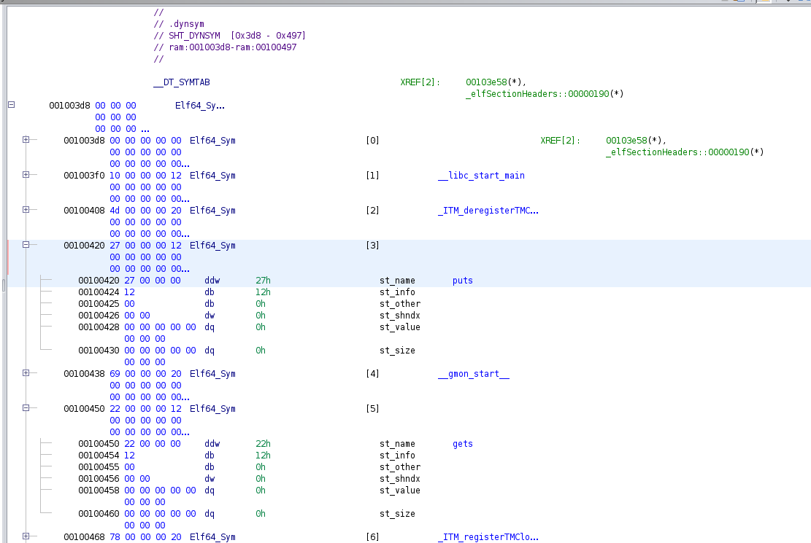

Which we see, when we look at the virtual addreses, we see the got entries for `puts/gets`:

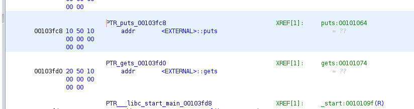

We can also see the relocation using `readelf`. We see that the symbol type of `0x7` corresponds to the `R_X86_64_JUMP_SLO` relocation type:

```
$	readelf -r try

Relocation section '.rela.dyn' at offset 0x570 contains 8 entries:
  Offset          Info           Type           Sym. Value    Sym. Name + Addend
000000003db0  000000000008 R_X86_64_RELATIVE                    1160
000000003db8  000000000008 R_X86_64_RELATIVE                    1120
000000004008  000000000008 R_X86_64_RELATIVE                    4008
000000003fd8  000100000006 R_X86_64_GLOB_DAT 0000000000000000 __libc_start_main@GLIBC_2.34 + 0
000000003fe0  000200000006 R_X86_64_GLOB_DAT 0000000000000000 _ITM_deregisterTM[...] + 0
000000003fe8  000400000006 R_X86_64_GLOB_DAT 0000000000000000 __gmon_start__ + 0
000000003ff0  000600000006 R_X86_64_GLOB_DAT 0000000000000000 _ITM_registerTMCl[...] + 0
000000003ff8  000700000006 R_X86_64_GLOB_DAT 0000000000000000 __cxa_finalize@GLIBC_2.2.5 + 0

Relocation section '.rela.plt' at offset 0x630 contains 2 entries:
  Offset          Info           Type           Sym. Value    Sym. Name + Addend
000000003fc8  000300000007 R_X86_64_JUMP_SLO 0000000000000000 puts@GLIBC_2.2.5 + 0
000000003fd0  000500000007 R_X86_64_JUMP_SLO 0000000000000000 gets@GLIBC_2.2.5 + 0
```

## Relocatable File Relocations

So to start off, we will be looking at the `.rela.text` section. It has multiple exntries but we will just look at the first two entries, both of which are going to be written to the `.text` section. One of which is to offset `0x0b` (with symbol index of `0x03`), and the second is to offset `0x13` (with symbol index of `0x05`):

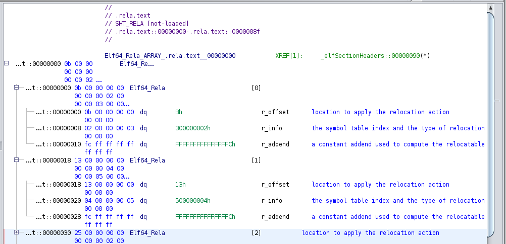

Looking at the section header table entry for `.rela.text`, we see that the `sh_link` value is `0x0b`:

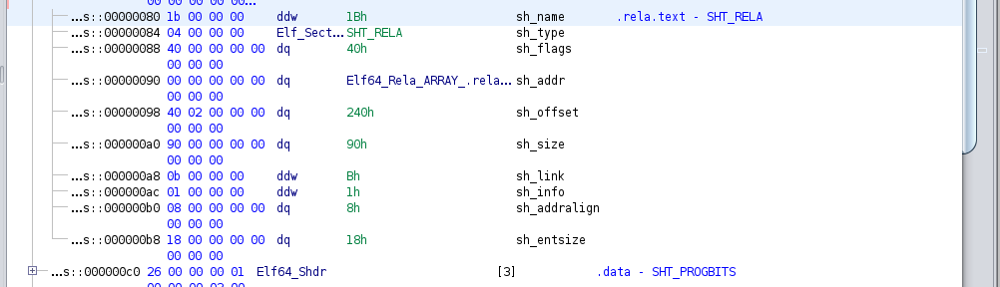

Which corresponds to the `.symtab` section:

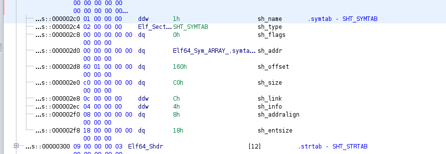

Looking at the `.symtab` section, we see that the symbols used for the relocations are `.rodata` (to the `.rodata` section itself) and `puts` (the function address to call for `puts`):

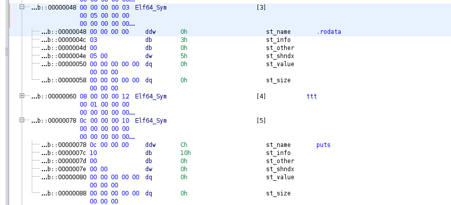

Looking at the `.rodata` section, we see it has some strings in it. I wrote the code, these strings are strings which will be printed by `puts`:

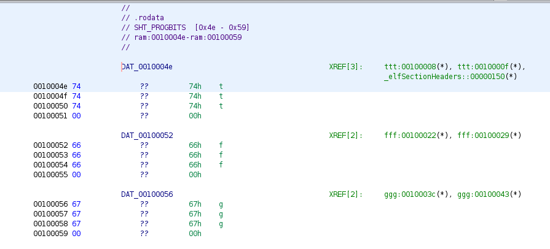

Now, looking at the `.text` section, we see where the relocations need to happen. At offset `0x0b`, it is in the middle of an instruction, specifically the argument to the `lea` instruction. This relocation is to actually put the address of the string to the `puts` call. At offset `0x13`, is the opcodes in the `call` instruction to specify what function address to call (which it is trying to call `puts`) here:

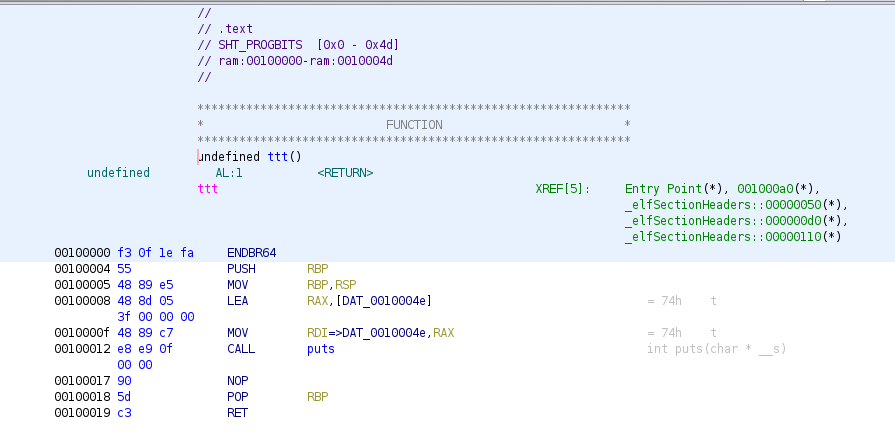

We can also see the relocations using `readelf`. We see that the `r_addend` fields are actually set. For some reason, the `.rela.text` `r_addend` values are all to `-4` the symbol data for the relocation. This is probably due to how the symbol value is generated (relocation types are `R_X86_64_PC32/R_X86_64_PLT32`), and the fact that the relocation is happening within the opcodes of an instruction, that uses relative offsets:

```
$	readelf -r test.o 

Relocation section '.rela.text' at offset 0x240 contains 6 entries:
  Offset          Info           Type           Sym. Value    Sym. Name + Addend
00000000000b  000300000002 R_X86_64_PC32     0000000000000000 .rodata - 4
000000000013  000500000004 R_X86_64_PLT32    0000000000000000 puts - 4
000000000025  000300000002 R_X86_64_PC32     0000000000000000 .rodata + 0
00000000002d  000500000004 R_X86_64_PLT32    0000000000000000 puts - 4
00000000003f  000300000002 R_X86_64_PC32     0000000000000000 .rodata + 4
000000000047  000500000004 R_X86_64_PLT32    0000000000000000 puts - 4

Relocation section '.rela.eh_frame' at offset 0x2d0 contains 3 entries:
  Offset          Info           Type           Sym. Value    Sym. Name + Addend
000000000020  000200000002 R_X86_64_PC32     0000000000000000 .text + 0
000000000040  000200000002 R_X86_64_PC32     0000000000000000 .text + 1a
000000000060  000200000002 R_X86_64_PC32     0000000000000000 .text + 34
```