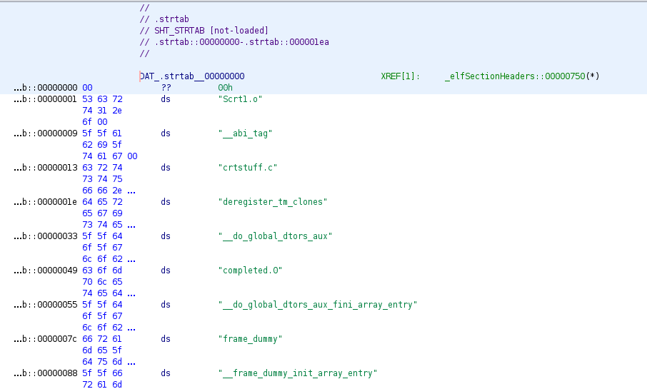

# Sections

So, this is a list, of a lot of the common sections you will see in ELFS.


* [bss](#bss)
* [comment](#comment)
* [data](#data)
* [dynamic](#dynamic)
* [dynstr](#dynstr)
* [dynsym](#dynsym)
* [eh_frame](#eh_frame)
* [fini](#fini)
* [fini_array](#fini_array)
* [got](#got)
* [gnu.hash](#gnu.hash)
* [init](#init)
* [init_array](#init_array)
* [interp](#interp)
* [note](#note)
* [plt](#plt)
* [plt.got](#plt.got)
* [plt.sec](#plt.sec)
* [rela](#rela)
* [rela.dyn](#rela.dyn)
* [rela.plt](#rela.plt)
* [rodata](#rodata)
* [shstrtab](#shstrtab)
* [strtab](#strtab)
* [symtab](#symtab)
* [text](#text)

## bss

Type: SHT_NOBITS

This section, is supposed to be a block of memory used for uninitialized global variables. All of the data in it, is initialized to `0x00`. As such, there isn't any data present in the object image file.

Here is a picture of a bss section, which contains an uninitialized variable `bss_int`:


## comment

Type: SHT_PROGBITS

This is a section, which doesn't hold data crticial to link/run the executable/object file. It holds details/comments about the elf.

In this instance, we see it's the version of the compiler that is used:


## data

Type: SHT_PROGBITS

This is a section, which is a block of memory to store initialzed global variables. The primary difference between this and the `.bss` section, is the `.data` section contains data that is initialized to a particular value. As such, it's data needs to occupy space in the object image file.

Here is a picture of a data section, which contains the variable `data_int`, initialized to the value `0xdeadbeef`:


## dynamic

Type: SHT_DYNAMIC

This section deals with dynamic entries, which each one provides specific information to the dynamic linker. The information for this section is a bit long, please check the `.dynamic` section docs in this repo for more information.

## dynstr

Type: SHT_STRTAB 

This section is an array of null terminated strings. It contains strings needed for dynamic linking.

Here is an example picture:


## dynsym

Type: SHT_DYNSYM

This section was documented a lot more in the symbols section.

It contains symbols, that are needed at runtime.

## eh_frame

Type: SHT_PROGBITS

This section is primarily used for exceptions (it stands for exception handler frame). It is to specify the call frames, that can be unwound durring the processing of excpetions.

## fini

Type: SHT_PROGBITS

So, there are constructors and deconstructors. Constructors are ran before the main function runs, and deconstructors run after the main function exits.

If you want code to be ran as part of the deconstructors, you have two seperate options. The first, is to include it as part of a block of code (`_fini` function) which will get ran after the main function ends.

Here, we see an example of a `_fini` function, although it doesn't really do anything:


And here, we see an example of the `_fini` function running:

```
$	gdb ./test 
GNU gdb (Ubuntu 12.0.90-0ubuntu1) 12.0.90
Copyright (C) 2022 Free Software Foundation, Inc.
License GPLv3+: GNU GPL version 3 or later <http://gnu.org/licenses/gpl.html>
This is free software: you are free to change and redistribute it.
There is NO WARRANTY, to the extent permitted by law.
Type "show copying" and "show warranty" for details.
This GDB was configured as "x86_64-linux-gnu".
Type "show configuration" for configuration details.
For bug reporting instructions, please see:
<https://www.gnu.org/software/gdb/bugs/>.
Find the GDB manual and other documentation resources online at:
    <http://www.gnu.org/software/gdb/documentation/>.

For help, type "help".
Type "apropos word" to search for commands related to "word"...
GEF for linux ready, type `gef' to start, `gef config' to configure
89 commands loaded and 5 functions added for GDB 12.0.90 in 0.00ms using Python engine 3.10
GEF for linux ready, type `gef' to start, `gef config' to configure
89 commands loaded and 5 functions added for GDB 12.0.90 in 0.00ms using Python engine 3.10
Reading symbols from ./test...
(No debugging symbols found in ./test)
gef➤  b *_fini
Breakpoint 1 at 0x1164
gef➤  r
Starting program: /elf/segments_sections/test 
[Thread debugging using libthread_db enabled]
Using host libthread_db library "/lib/x86_64-linux-gnu/libthread_db.so.1".
hi

Breakpoint 1, 0x0000555555555164 in _fini ()

[ Legend: Modified register | Code | Heap | Stack | String ]
──────────────────────────────────────────────────────────────────────────────────────────────────────────────────────────────────────────────────────────────────────────────────────────── registers ────
$rax   : 0x0000555555555164  →  <_fini+0> endbr64 
$rbx   : 0x00007ffff7ffd040  →  0x00007ffff7ffe2e0  →  0x0000555555554000  →   jg 0x555555554047
$rcx   : 0x0               
$rdx   : 0x0000555555557dc0  →  0x0000555555555100  →  <__do_global_dtors_aux+0> endbr64 
$rsp   : 0x00007fffffffdee8  →  0x00007ffff7fc9274  →  <_dl_fini+564> mov rdi, r15
$rbp   : 0x00007fffffffdf70  →  0x0000000000000003
$rsi   : 0x0               
$rdi   : 0x0000555555558018  →  <bss_int+0> add BYTE PTR [rax], al
$rip   : 0x0000555555555164  →  <_fini+0> endbr64 
$r8    : 0x00007fffffffdef0  →  0x00007ffff7ffe2e0  →  0x0000555555554000  →   jg 0x555555554047
$r9    : 0x20              
$r10   : 0x0               
$r11   : 0x00007fffffffde20  →  0x00007ffff7ffe2e0  →  0x0000555555554000  →   jg 0x555555554047
$r12   : 0x0               
$r13   : 0x00007ffff7ffda48  →  0x0000000000000000
$r14   : 0x00007fffffffdef0  →  0x00007ffff7ffe2e0  →  0x0000555555554000  →   jg 0x555555554047
$r15   : 0x00007ffff7ffe2e0  →  0x0000555555554000  →   jg 0x555555554047
$eflags: [zero carry parity adjust sign trap INTERRUPT direction overflow resume virtualx86 identification]
$cs: 0x33 $ss: 0x2b $ds: 0x00 $es: 0x00 $fs: 0x00 $gs: 0x00 
──────────────────────────────────────────────────────────────────────────────────────────────────────────────────────────────────────────────────────────────────────────────────────────────── stack ────
0x00007fffffffdee8│+0x0000: 0x00007ffff7fc9274  →  <_dl_fini+564> mov rdi, r15	 ← $rsp
0x00007fffffffdef0│+0x0008: 0x00007ffff7ffe2e0  →  0x0000555555554000  →   jg 0x555555554047	 ← $r8, $r14
0x00007fffffffdef8│+0x0010: 0x00007ffff7ffe890  →  0x00007ffff7fc1000  →  0x00010102464c457f
0x00007fffffffdf00│+0x0018: 0x00007ffff7fbb160  →  0x00007ffff7c00000  →  0x03010102464c457f
0x00007fffffffdf08│+0x0020: 0x00007ffff7ffdaf0  →  0x00007ffff7fc3000  →  0x03010102464c457f
0x00007fffffffdf10│+0x0028: 0x00000000ffffffff
0x00007fffffffdf18│+0x0030: 0x00007fffffffdf10  →  0x00000000ffffffff
0x00007fffffffdf20│+0x0038: 0x00007fffffffdf10  →  0x00000000ffffffff
────────────────────────────────────────────────────────────────────────────────────────────────────────────────────────────────────────────────────────────────────────────────────────── code:x86:64 ────
 → 0x555555555164 <_fini+0>        endbr64 
   0x555555555168 <_fini+4>        sub    rsp, 0x8
   0x55555555516c <_fini+8>        add    rsp, 0x8
   0x555555555170 <_fini+12>       ret    
   0x555555555171                  add    BYTE PTR [rax], al
   0x555555555173                  add    BYTE PTR [rax], al
────────────────────────────────────────────────────────────────────────────────────────────────────────────────────────────────────────────────────────────────────────────────────────────── threads ────
[#0] Id 1, Name: "test", stopped 0x555555555164 in _fini (), reason: BREAKPOINT
──────────────────────────────────────────────────────────────────────────────────────────────────────────────────────────────────────────────────────────────────────────────────────────────── trace ────
[#0] 0x555555555164 → _fini()
[#1] 0x7ffff7fc9274 → _dl_fini()
[#2] 0x7ffff7c45495 → __run_exit_handlers(status=0x3, listp=0x7ffff7e1a838 <__exit_funcs>, run_list_atexit=0x1, run_dtors=0x1)
[#3] 0x7ffff7c45610 → __GI_exit(status=<optimized out>)
[#4] 0x7ffff7c29d97 → __libc_start_call_main(main=0x555555555149 <main>, argc=0x1, argv=0x7fffffffe0f8)
[#5] 0x7ffff7c29e40 → __libc_start_main_impl(main=0x555555555149 <main>, argc=0x1, argv=0x7fffffffe0f8, init=<optimized out>, fini=<optimized out>, rtld_fini=<optimized out>, stack_end=0x7fffffffe0e8)
[#6] 0x555555555085 → _start()
───────────────────────────────────────────────────────────────────────────────────────────────────────────────────────────────────────────────────────────────────────────────────────────────────────────


[ Legend: Modified register | Code | Heap | Stack | String ]
──────────────────────────────────────────────────────────────────────────────────────────────────────────────────────────────────────────────────────────────────────────────────────────── registers ────
$rax   : 0x0000555555555164  →  <_fini+0> endbr64 
$rbx   : 0x00007ffff7ffd040  →  0x00007ffff7ffe2e0  →  0x0000555555554000  →   jg 0x555555554047
$rcx   : 0x0               
$rdx   : 0x0000555555557dc0  →  0x0000555555555100  →  <__do_global_dtors_aux+0> endbr64 
$rsp   : 0x00007fffffffdee8  →  0x00007ffff7fc9274  →  <_dl_fini+564> mov rdi, r15
$rbp   : 0x00007fffffffdf70  →  0x0000000000000003
$rsi   : 0x0               
$rdi   : 0x0000555555558018  →  <bss_int+0> add BYTE PTR [rax], al
$rip   : 0x0000555555555164  →  <_fini+0> endbr64 
$r8    : 0x00007fffffffdef0  →  0x00007ffff7ffe2e0  →  0x0000555555554000  →   jg 0x555555554047
$r9    : 0x20              
$r10   : 0x0               
$r11   : 0x00007fffffffde20  →  0x00007ffff7ffe2e0  →  0x0000555555554000  →   jg 0x555555554047
$r12   : 0x0               
$r13   : 0x00007ffff7ffda48  →  0x0000000000000000
$r14   : 0x00007fffffffdef0  →  0x00007ffff7ffe2e0  →  0x0000555555554000  →   jg 0x555555554047
$r15   : 0x00007ffff7ffe2e0  →  0x0000555555554000  →   jg 0x555555554047
$eflags: [zero carry parity adjust sign trap INTERRUPT direction overflow resume virtualx86 identification]
$cs: 0x33 $ss: 0x2b $ds: 0x00 $es: 0x00 $fs: 0x00 $gs: 0x00 
──────────────────────────────────────────────────────────────────────────────────────────────────────────────────────────────────────────────────────────────────────────────────────────────── stack ────
0x00007fffffffdee8│+0x0000: 0x00007ffff7fc9274  →  <_dl_fini+564> mov rdi, r15	 ← $rsp
0x00007fffffffdef0│+0x0008: 0x00007ffff7ffe2e0  →  0x0000555555554000  →   jg 0x555555554047	 ← $r8, $r14
0x00007fffffffdef8│+0x0010: 0x00007ffff7ffe890  →  0x00007ffff7fc1000  →  0x00010102464c457f
0x00007fffffffdf00│+0x0018: 0x00007ffff7fbb160  →  0x00007ffff7c00000  →  0x03010102464c457f
0x00007fffffffdf08│+0x0020: 0x00007ffff7ffdaf0  →  0x00007ffff7fc3000  →  0x03010102464c457f
0x00007fffffffdf10│+0x0028: 0x00000000ffffffff
0x00007fffffffdf18│+0x0030: 0x00007fffffffdf10  →  0x00000000ffffffff
0x00007fffffffdf20│+0x0038: 0x00007fffffffdf10  →  0x00000000ffffffff
────────────────────────────────────────────────────────────────────────────────────────────────────────────────────────────────────────────────────────────────────────────────────────── code:x86:64 ────
 → 0x555555555164 <_fini+0>        endbr64 
   0x555555555168 <_fini+4>        sub    rsp, 0x8
   0x55555555516c <_fini+8>        add    rsp, 0x8
   0x555555555170 <_fini+12>       ret    
   0x555555555171                  add    BYTE PTR [rax], al
   0x555555555173                  add    BYTE PTR [rax], al
────────────────────────────────────────────────────────────────────────────────────────────────────────────────────────────────────────────────────────────────────────────────────────────── threads ────
[#0] Id 1, Name: "test", stopped 0x555555555164 in _fini (), reason: BREAKPOINT
──────────────────────────────────────────────────────────────────────────────────────────────────────────────────────────────────────────────────────────────────────────────────────────────── trace ────
[#0] 0x555555555164 → _fini()
[#1] 0x7ffff7fc9274 → _dl_fini()
[#2] 0x7ffff7c45495 → __run_exit_handlers(status=0x3, listp=0x7ffff7e1a838 <__exit_funcs>, run_list_atexit=0x1, run_dtors=0x1)
[#3] 0x7ffff7c45610 → __GI_exit(status=<optimized out>)
[#4] 0x7ffff7c29d97 → __libc_start_call_main(main=0x555555555149 <main>, argc=0x1, argv=0x7fffffffe0f8)
[#5] 0x7ffff7c29e40 → __libc_start_main_impl(main=0x555555555149 <main>, argc=0x1, argv=0x7fffffffe0f8, init=<optimized out>, fini=<optimized out>, rtld_fini=<optimized out>, stack_end=0x7fffffffe0e8)
[#6] 0x555555555085 → _start()
───────────────────────────────────────────────────────────────────────────────────────────────────────────────────────────────────────────────────────────────────────────────────────────────────────────
gef➤  bt
#0  0x0000555555555164 in _fini ()
#1  0x00007ffff7fc9274 in _dl_fini () at ./elf/dl-fini.c:147
#2  0x00007ffff7c45495 in __run_exit_handlers (status=0x3, listp=0x7ffff7e1a838 <__exit_funcs>, run_list_atexit=run_list_atexit@entry=0x1, run_dtors=run_dtors@entry=0x1) at ./stdlib/exit.c:113
#3  0x00007ffff7c45610 in __GI_exit (status=<optimized out>) at ./stdlib/exit.c:143
#4  0x00007ffff7c29d97 in __libc_start_call_main (main=main@entry=0x555555555149 <main>, argc=argc@entry=0x1, argv=argv@entry=0x7fffffffe0f8) at ../sysdeps/nptl/libc_start_call_main.h:74
#5  0x00007ffff7c29e40 in __libc_start_main_impl (main=0x555555555149 <main>, argc=0x1, argv=0x7fffffffe0f8, init=<optimized out>, fini=<optimized out>, rtld_fini=<optimized out>, stack_end=0x7fffffffe0e8) at ../csu/libc-start.c:392
#6  0x0000555555555085 in _start ()
gef➤  c
Continuing.
[Inferior 1 (process 33833) exited with code 03]
```

## fini_array

Type: SHT_FINI_ARRAY

So this, is another method to have deconstructors, similar to `.fini`. The difference is, `.fini` is effectively just the a single function. The `.fini_array` contains an array of different function pointers, each of which will get executed. So the `.fini` is just a single function (just the code itself), and the `.fini_array` function holds an array of function pointers to be executed.

Here is an example of one, which just contains a single function (`__do_global_dtors_aux`):


Which we can see it getting executed here:

```
$	gdb ./test 
GNU gdb (Ubuntu 12.0.90-0ubuntu1) 12.0.90
Copyright (C) 2022 Free Software Foundation, Inc.
License GPLv3+: GNU GPL version 3 or later <http://gnu.org/licenses/gpl.html>
This is free software: you are free to change and redistribute it.
There is NO WARRANTY, to the extent permitted by law.
Type "show copying" and "show warranty" for details.
This GDB was configured as "x86_64-linux-gnu".
Type "show configuration" for configuration details.
For bug reporting instructions, please see:
<https://www.gnu.org/software/gdb/bugs/>.
Find the GDB manual and other documentation resources online at:
    <http://www.gnu.org/software/gdb/documentation/>.

For help, type "help".
Type "apropos word" to search for commands related to "word"...
GEF for linux ready, type `gef' to start, `gef config' to configure
89 commands loaded and 5 functions added for GDB 12.0.90 in 0.00ms using Python engine 3.10
GEF for linux ready, type `gef' to start, `gef config' to configure
89 commands loaded and 5 functions added for GDB 12.0.90 in 0.00ms using Python engine 3.10
Reading symbols from ./test...
(No debugging symbols found in ./test)
gef➤  b *__do_global_dtors_aux
Breakpoint 1 at 0x1100
gef➤  r
Starting program: /elf/segments_sections/test 
[Thread debugging using libthread_db enabled]
Using host libthread_db library "/lib/x86_64-linux-gnu/libthread_db.so.1".
hi

Breakpoint 1, 0x0000555555555100 in __do_global_dtors_aux ()

[ Legend: Modified register | Code | Heap | Stack | String ]
──────────────────────────────────────────────────────────────────────────────────────────────────────────────────────────────────────────────────────────────────────────────────────────── registers ────
$rax   : 0x0000555555557dc0  →  0x0000555555555100  →  <__do_global_dtors_aux+0> endbr64 
$rbx   : 0x00007ffff7ffd040  →  0x00007ffff7ffe2e0  →  0x0000555555554000  →   jg 0x555555554047
$rcx   : 0x1               
$rdx   : 0x1               
$rsp   : 0x00007fffffffdee8  →  0x00007ffff7fc924e  →  <_dl_fini+526> mov rax, QWORD PTR [rbp-0x38]
$rbp   : 0x00007fffffffdf70  →  0x0000000000000003
$rsi   : 0x0000555555557dc0  →  0x0000555555555100  →  <__do_global_dtors_aux+0> endbr64 
$rdi   : 0x00007ffff7ffda48  →  0x0000000000000000
$rip   : 0x0000555555555100  →  <__do_global_dtors_aux+0> endbr64 
$r8    : 0x00007fffffffdef0  →  0x00007ffff7ffe2e0  →  0x0000555555554000  →   jg 0x555555554047
$r9    : 0x20              
$r10   : 0x0               
$r11   : 0x00007fffffffde20  →  0x00007ffff7ffe2e0  →  0x0000555555554000  →   jg 0x555555554047
$r12   : 0x0               
$r13   : 0x00007ffff7ffda48  →  0x0000000000000000
$r14   : 0x00007fffffffdef0  →  0x00007ffff7ffe2e0  →  0x0000555555554000  →   jg 0x555555554047
$r15   : 0x00007ffff7ffe2e0  →  0x0000555555554000  →   jg 0x555555554047
$eflags: [zero carry parity adjust sign trap INTERRUPT direction overflow resume virtualx86 identification]
$cs: 0x33 $ss: 0x2b $ds: 0x00 $es: 0x00 $fs: 0x00 $gs: 0x00 
──────────────────────────────────────────────────────────────────────────────────────────────────────────────────────────────────────────────────────────────────────────────────────────────── stack ────
0x00007fffffffdee8│+0x0000: 0x00007ffff7fc924e  →  <_dl_fini+526> mov rax, QWORD PTR [rbp-0x38]	 ← $rsp
0x00007fffffffdef0│+0x0008: 0x00007ffff7ffe2e0  →  0x0000555555554000  →   jg 0x555555554047	 ← $r8, $r14
0x00007fffffffdef8│+0x0010: 0x00007ffff7ffe890  →  0x00007ffff7fc1000  →  0x00010102464c457f
0x00007fffffffdf00│+0x0018: 0x00007ffff7fbb160  →  0x00007ffff7c00000  →  0x03010102464c457f
0x00007fffffffdf08│+0x0020: 0x00007ffff7ffdaf0  →  0x00007ffff7fc3000  →  0x03010102464c457f
0x00007fffffffdf10│+0x0028: 0x00000000ffffffff
0x00007fffffffdf18│+0x0030: 0x00007fffffffdf10  →  0x00000000ffffffff
0x00007fffffffdf20│+0x0038: 0x00007fffffffdf10  →  0x00000000ffffffff
────────────────────────────────────────────────────────────────────────────────────────────────────────────────────────────────────────────────────────────────────────────────────────── code:x86:64 ────
   0x5555555550f2 <register_tm_clones+50> nop    WORD PTR [rax+rax*1+0x0]
   0x5555555550f8 <register_tm_clones+56> ret    
   0x5555555550f9 <register_tm_clones+57> nop    DWORD PTR [rax+0x0]
 → 0x555555555100 <__do_global_dtors_aux+0> endbr64 
   0x555555555104 <__do_global_dtors_aux+4> cmp    BYTE PTR [rip+0x2f09], 0x0        # 0x555555558014 <completed.0>
   0x55555555510b <__do_global_dtors_aux+11> jne    0x555555555138 <__do_global_dtors_aux+56>
   0x55555555510d <__do_global_dtors_aux+13> push   rbp
   0x55555555510e <__do_global_dtors_aux+14> cmp    QWORD PTR [rip+0x2ee2], 0x0        # 0x555555557ff8
   0x555555555116 <__do_global_dtors_aux+22> mov    rbp, rsp
────────────────────────────────────────────────────────────────────────────────────────────────────────────────────────────────────────────────────────────────────────────────────────────── threads ────
[#0] Id 1, Name: "test", stopped 0x555555555100 in __do_global_dtors_aux (), reason: BREAKPOINT
──────────────────────────────────────────────────────────────────────────────────────────────────────────────────────────────────────────────────────────────────────────────────────────────── trace ────
[#0] 0x555555555100 → __do_global_dtors_aux()
[#1] 0x7ffff7fc924e → _dl_fini()
[#2] 0x7ffff7c45495 → __run_exit_handlers(status=0x3, listp=0x7ffff7e1a838 <__exit_funcs>, run_list_atexit=0x1, run_dtors=0x1)
[#3] 0x7ffff7c45610 → __GI_exit(status=<optimized out>)
[#4] 0x7ffff7c29d97 → __libc_start_call_main(main=0x555555555149 <main>, argc=0x1, argv=0x7fffffffe0f8)
[#5] 0x7ffff7c29e40 → __libc_start_main_impl(main=0x555555555149 <main>, argc=0x1, argv=0x7fffffffe0f8, init=<optimized out>, fini=<optimized out>, rtld_fini=<optimized out>, stack_end=0x7fffffffe0e8)
[#6] 0x555555555085 → _start()
───────────────────────────────────────────────────────────────────────────────────────────────────────────────────────────────────────────────────────────────────────────────────────────────────────────


[ Legend: Modified register | Code | Heap | Stack | String ]
──────────────────────────────────────────────────────────────────────────────────────────────────────────────────────────────────────────────────────────────────────────────────────────── registers ────
$rax   : 0x0000555555557dc0  →  0x0000555555555100  →  <__do_global_dtors_aux+0> endbr64 
$rbx   : 0x00007ffff7ffd040  →  0x00007ffff7ffe2e0  →  0x0000555555554000  →   jg 0x555555554047
$rcx   : 0x1               
$rdx   : 0x1               
$rsp   : 0x00007fffffffdee8  →  0x00007ffff7fc924e  →  <_dl_fini+526> mov rax, QWORD PTR [rbp-0x38]
$rbp   : 0x00007fffffffdf70  →  0x0000000000000003
$rsi   : 0x0000555555557dc0  →  0x0000555555555100  →  <__do_global_dtors_aux+0> endbr64 
$rdi   : 0x00007ffff7ffda48  →  0x0000000000000000
$rip   : 0x0000555555555100  →  <__do_global_dtors_aux+0> endbr64 
$r8    : 0x00007fffffffdef0  →  0x00007ffff7ffe2e0  →  0x0000555555554000  →   jg 0x555555554047
$r9    : 0x20              
$r10   : 0x0               
$r11   : 0x00007fffffffde20  →  0x00007ffff7ffe2e0  →  0x0000555555554000  →   jg 0x555555554047
$r12   : 0x0               
$r13   : 0x00007ffff7ffda48  →  0x0000000000000000
$r14   : 0x00007fffffffdef0  →  0x00007ffff7ffe2e0  →  0x0000555555554000  →   jg 0x555555554047
$r15   : 0x00007ffff7ffe2e0  →  0x0000555555554000  →   jg 0x555555554047
$eflags: [zero carry parity adjust sign trap INTERRUPT direction overflow resume virtualx86 identification]
$cs: 0x33 $ss: 0x2b $ds: 0x00 $es: 0x00 $fs: 0x00 $gs: 0x00 
──────────────────────────────────────────────────────────────────────────────────────────────────────────────────────────────────────────────────────────────────────────────────────────────── stack ────
0x00007fffffffdee8│+0x0000: 0x00007ffff7fc924e  →  <_dl_fini+526> mov rax, QWORD PTR [rbp-0x38]	 ← $rsp
0x00007fffffffdef0│+0x0008: 0x00007ffff7ffe2e0  →  0x0000555555554000  →   jg 0x555555554047	 ← $r8, $r14
0x00007fffffffdef8│+0x0010: 0x00007ffff7ffe890  →  0x00007ffff7fc1000  →  0x00010102464c457f
0x00007fffffffdf00│+0x0018: 0x00007ffff7fbb160  →  0x00007ffff7c00000  →  0x03010102464c457f
0x00007fffffffdf08│+0x0020: 0x00007ffff7ffdaf0  →  0x00007ffff7fc3000  →  0x03010102464c457f
0x00007fffffffdf10│+0x0028: 0x00000000ffffffff
0x00007fffffffdf18│+0x0030: 0x00007fffffffdf10  →  0x00000000ffffffff
0x00007fffffffdf20│+0x0038: 0x00007fffffffdf10  →  0x00000000ffffffff
────────────────────────────────────────────────────────────────────────────────────────────────────────────────────────────────────────────────────────────────────────────────────────── code:x86:64 ────
   0x5555555550f2 <register_tm_clones+50> nop    WORD PTR [rax+rax*1+0x0]
   0x5555555550f8 <register_tm_clones+56> ret    
   0x5555555550f9 <register_tm_clones+57> nop    DWORD PTR [rax+0x0]
 → 0x555555555100 <__do_global_dtors_aux+0> endbr64 
   0x555555555104 <__do_global_dtors_aux+4> cmp    BYTE PTR [rip+0x2f09], 0x0        # 0x555555558014 <completed.0>
   0x55555555510b <__do_global_dtors_aux+11> jne    0x555555555138 <__do_global_dtors_aux+56>
   0x55555555510d <__do_global_dtors_aux+13> push   rbp
   0x55555555510e <__do_global_dtors_aux+14> cmp    QWORD PTR [rip+0x2ee2], 0x0        # 0x555555557ff8
   0x555555555116 <__do_global_dtors_aux+22> mov    rbp, rsp
────────────────────────────────────────────────────────────────────────────────────────────────────────────────────────────────────────────────────────────────────────────────────────────── threads ────
[#0] Id 1, Name: "test", stopped 0x555555555100 in __do_global_dtors_aux (), reason: BREAKPOINT
──────────────────────────────────────────────────────────────────────────────────────────────────────────────────────────────────────────────────────────────────────────────────────────────── trace ────
[#0] 0x555555555100 → __do_global_dtors_aux()
[#1] 0x7ffff7fc924e → _dl_fini()
[#2] 0x7ffff7c45495 → __run_exit_handlers(status=0x3, listp=0x7ffff7e1a838 <__exit_funcs>, run_list_atexit=0x1, run_dtors=0x1)
[#3] 0x7ffff7c45610 → __GI_exit(status=<optimized out>)
[#4] 0x7ffff7c29d97 → __libc_start_call_main(main=0x555555555149 <main>, argc=0x1, argv=0x7fffffffe0f8)
[#5] 0x7ffff7c29e40 → __libc_start_main_impl(main=0x555555555149 <main>, argc=0x1, argv=0x7fffffffe0f8, init=<optimized out>, fini=<optimized out>, rtld_fini=<optimized out>, stack_end=0x7fffffffe0e8)
[#6] 0x555555555085 → _start()
───────────────────────────────────────────────────────────────────────────────────────────────────────────────────────────────────────────────────────────────────────────────────────────────────────────
gef➤  bt
#0  0x0000555555555100 in __do_global_dtors_aux ()
#1  0x00007ffff7fc924e in _dl_fini () at ./elf/dl-fini.c:142
#2  0x00007ffff7c45495 in __run_exit_handlers (status=0x3, listp=0x7ffff7e1a838 <__exit_funcs>, run_list_atexit=run_list_atexit@entry=0x1, run_dtors=run_dtors@entry=0x1) at ./stdlib/exit.c:113
#3  0x00007ffff7c45610 in __GI_exit (status=<optimized out>) at ./stdlib/exit.c:143
#4  0x00007ffff7c29d97 in __libc_start_call_main (main=main@entry=0x555555555149 <main>, argc=argc@entry=0x1, argv=argv@entry=0x7fffffffe0f8) at ../sysdeps/nptl/libc_start_call_main.h:74
#5  0x00007ffff7c29e40 in __libc_start_main_impl (main=0x555555555149 <main>, argc=0x1, argv=0x7fffffffe0f8, init=<optimized out>, fini=<optimized out>, rtld_fini=<optimized out>, stack_end=0x7fffffffe0e8) at ../csu/libc-start.c:392
#6  0x0000555555555085 in _start ()
gef➤  c
Continuing.
[Inferior 1 (process 33980) exited with code 03]
```

## got

type: SHT_PROGBITS

This section typically works hand in hand with the `.plt` section. This section deals with with dynamic linking.

With dynamic linking, code/data gets linked in at runtime. As such, our code that links that code/data at runtime, won't know the addresses for those things until runtime. This solves that problem, by keeping spaces at known addresses for those addresses (known at compile time, way before runtime). That way, once we know the address of the linked code/data, we can place it at that known spot. Then our code can get to those pointers, sicne they are at a known address.

Here is an example, we can see that the libc address for `puts` and `gets` are stored at `0x00103fc8` and `0x00103fd0`:


Which we can see those addresses in action in gdb. Also, the addresses are at offsets of `0x00003fc8` and `0x00003fd0` (the binary has PIE, and ghidra bases the binary to `0x00100000`):

```
$ gdb ./try 
GNU gdb (Ubuntu 12.0.90-0ubuntu1) 12.0.90
Copyright (C) 2022 Free Software Foundation, Inc.
License GPLv3+: GNU GPL version 3 or later <http://gnu.org/licenses/gpl.html>
This is free software: you are free to change and redistribute it.
There is NO WARRANTY, to the extent permitted by law.
Type "show copying" and "show warranty" for details.
This GDB was configured as "x86_64-linux-gnu".
Type "show configuration" for configuration details.
For bug reporting instructions, please see:
<https://www.gnu.org/software/gdb/bugs/>.
Find the GDB manual and other documentation resources online at:
    <http://www.gnu.org/software/gdb/documentation/>.

For help, type "help".
Type "apropos word" to search for commands related to "word"...
GEF for linux ready, type `gef' to start, `gef config' to configure
89 commands loaded and 5 functions added for GDB 12.0.90 in 0.00ms using Python engine 3.10
GEF for linux ready, type `gef' to start, `gef config' to configure
89 commands loaded and 5 functions added for GDB 12.0.90 in 0.00ms using Python engine 3.10
Reading symbols from ./try...
(No debugging symbols found in ./try)
gef➤  b *main
Breakpoint 1 at 0x1169
gef➤  r
Starting program: /elf/try 
[Thread debugging using libthread_db enabled]
Using host libthread_db library "/lib/x86_64-linux-gnu/libthread_db.so.1".

Breakpoint 1, 0x0000555555555169 in main ()

[ Legend: Modified register | Code | Heap | Stack | String ]
──────────────────────────────────────────────────────────────────────────────────────────────────────────────────────────────────────────────────────────────────────────────────────────── registers ────
$rax   : 0x0000555555555169  →  <main+0> endbr64 
$rbx   : 0x0               
$rcx   : 0x0000555555557db8  →  0x0000555555555120  →  <__do_global_dtors_aux+0> endbr64 
$rdx   : 0x00007fffffffe138  →  0x00007fffffffe473  →  "SHELL=/bin/bash"
$rsp   : 0x00007fffffffe018  →  0x00007ffff7c29d90  →  <__libc_start_call_main+128> mov edi, eax
$rbp   : 0x1               
$rsi   : 0x00007fffffffe128  →  0x00007fffffffe44e  →  "/elf/try"
$rdi   : 0x1               
$rip   : 0x0000555555555169  →  <main+0> endbr64 
$r8    : 0x00007ffff7e1bf10  →  0x0000000000000004
$r9    : 0x00007ffff7fc9040  →  <_dl_fini+0> endbr64 
$r10   : 0x00007ffff7fc3908  →  0x000d00120000000e
$r11   : 0x00007ffff7fde660  →  <_dl_audit_preinit+0> endbr64 
$r12   : 0x00007fffffffe128  →  0x00007fffffffe44e  →  "/elf/try"
$r13   : 0x0000555555555169  →  <main+0> endbr64 
$r14   : 0x0000555555557db8  →  0x0000555555555120  →  <__do_global_dtors_aux+0> endbr64 
$r15   : 0x00007ffff7ffd040  →  0x00007ffff7ffe2e0  →  0x0000555555554000  →   jg 0x555555554047
$eflags: [ZERO carry PARITY adjust sign trap INTERRUPT direction overflow resume virtualx86 identification]
$cs: 0x33 $ss: 0x2b $ds: 0x00 $es: 0x00 $fs: 0x00 $gs: 0x00 
──────────────────────────────────────────────────────────────────────────────────────────────────────────────────────────────────────────────────────────────────────────────────────────────── stack ────
0x00007fffffffe018│+0x0000: 0x00007ffff7c29d90  →  <__libc_start_call_main+128> mov edi, eax   ← $rsp
0x00007fffffffe020│+0x0008: 0x0000000000000000
0x00007fffffffe028│+0x0010: 0x0000555555555169  →  <main+0> endbr64 
0x00007fffffffe030│+0x0018: 0x00000001ffffe110
0x00007fffffffe038│+0x0020: 0x00007fffffffe128  →  0x00007fffffffe44e  →  "/elf/try"
0x00007fffffffe040│+0x0028: 0x0000000000000000
0x00007fffffffe048│+0x0030: 0x9189e16b6785e3ee
0x00007fffffffe050│+0x0038: 0x00007fffffffe128  →  0x00007fffffffe44e  →  "/elf/try"
────────────────────────────────────────────────────────────────────────────────────────────────────────────────────────────────────────────────────────────────────────────────────────── code:x86:64 ────
   0x555555555159 <__do_global_dtors_aux+57> nop    DWORD PTR [rax+0x0]
   0x555555555160 <frame_dummy+0>  endbr64 
   0x555555555164 <frame_dummy+4>  jmp    0x5555555550e0 <register_tm_clones>
 → 0x555555555169 <main+0>         endbr64 
   0x55555555516d <main+4>         push   rbp
   0x55555555516e <main+5>         mov    rbp, rsp
   0x555555555171 <main+8>         sub    rsp, 0x10
   0x555555555175 <main+12>        lea    rax, [rbp-0x5]
   0x555555555179 <main+16>        mov    rdi, rax
────────────────────────────────────────────────────────────────────────────────────────────────────────────────────────────────────────────────────────────────────────────────────────────── threads ────
[#0] Id 1, Name: "try", stopped 0x555555555169 in main (), reason: BREAKPOINT
──────────────────────────────────────────────────────────────────────────────────────────────────────────────────────────────────────────────────────────────────────────────────────────────── trace ────
[#0] 0x555555555169 → main()
───────────────────────────────────────────────────────────────────────────────────────────────────────────────────────────────────────────────────────────────────────────────────────────────────────────


[ Legend: Modified register | Code | Heap | Stack | String ]
──────────────────────────────────────────────────────────────────────────────────────────────────────────────────────────────────────────────────────────────────────────────────────────── registers ────
$rax   : 0x0000555555555169  →  <main+0> endbr64 
$rbx   : 0x0               
$rcx   : 0x0000555555557db8  →  0x0000555555555120  →  <__do_global_dtors_aux+0> endbr64 
$rdx   : 0x00007fffffffe138  →  0x00007fffffffe473  →  "SHELL=/bin/bash"
$rsp   : 0x00007fffffffe018  →  0x00007ffff7c29d90  →  <__libc_start_call_main+128> mov edi, eax
$rbp   : 0x1               
$rsi   : 0x00007fffffffe128  →  0x00007fffffffe44e  →  "/elf/try"
$rdi   : 0x1               
$rip   : 0x0000555555555169  →  <main+0> endbr64 
$r8    : 0x00007ffff7e1bf10  →  0x0000000000000004
$r9    : 0x00007ffff7fc9040  →  <_dl_fini+0> endbr64 
$r10   : 0x00007ffff7fc3908  →  0x000d00120000000e
$r11   : 0x00007ffff7fde660  →  <_dl_audit_preinit+0> endbr64 
$r12   : 0x00007fffffffe128  →  0x00007fffffffe44e  →  "/elf/try"
$r13   : 0x0000555555555169  →  <main+0> endbr64 
$r14   : 0x0000555555557db8  →  0x0000555555555120  →  <__do_global_dtors_aux+0> endbr64 
$r15   : 0x00007ffff7ffd040  →  0x00007ffff7ffe2e0  →  0x0000555555554000  →   jg 0x555555554047
$eflags: [ZERO carry PARITY adjust sign trap INTERRUPT direction overflow resume virtualx86 identification]
$cs: 0x33 $ss: 0x2b $ds: 0x00 $es: 0x00 $fs: 0x00 $gs: 0x00 
──────────────────────────────────────────────────────────────────────────────────────────────────────────────────────────────────────────────────────────────────────────────────────────────── stack ────
0x00007fffffffe018│+0x0000: 0x00007ffff7c29d90  →  <__libc_start_call_main+128> mov edi, eax   ← $rsp
0x00007fffffffe020│+0x0008: 0x0000000000000000
0x00007fffffffe028│+0x0010: 0x0000555555555169  →  <main+0> endbr64 
0x00007fffffffe030│+0x0018: 0x00000001ffffe110
0x00007fffffffe038│+0x0020: 0x00007fffffffe128  →  0x00007fffffffe44e  →  "/elf/try"
0x00007fffffffe040│+0x0028: 0x0000000000000000
0x00007fffffffe048│+0x0030: 0x9189e16b6785e3ee
0x00007fffffffe050│+0x0038: 0x00007fffffffe128  →  0x00007fffffffe44e  →  "/elf/try"
────────────────────────────────────────────────────────────────────────────────────────────────────────────────────────────────────────────────────────────────────────────────────────── code:x86:64 ────
   0x555555555159 <__do_global_dtors_aux+57> nop    DWORD PTR [rax+0x0]
   0x555555555160 <frame_dummy+0>  endbr64 
   0x555555555164 <frame_dummy+4>  jmp    0x5555555550e0 <register_tm_clones>
 → 0x555555555169 <main+0>         endbr64 
   0x55555555516d <main+4>         push   rbp
   0x55555555516e <main+5>         mov    rbp, rsp
   0x555555555171 <main+8>         sub    rsp, 0x10
   0x555555555175 <main+12>        lea    rax, [rbp-0x5]
   0x555555555179 <main+16>        mov    rdi, rax
────────────────────────────────────────────────────────────────────────────────────────────────────────────────────────────────────────────────────────────────────────────────────────────── threads ────
[#0] Id 1, Name: "try", stopped 0x555555555169 in main (), reason: BREAKPOINT
──────────────────────────────────────────────────────────────────────────────────────────────────────────────────────────────────────────────────────────────────────────────────────────────── trace ────
[#0] 0x555555555169 → main()
───────────────────────────────────────────────────────────────────────────────────────────────────────────────────────────────────────────────────────────────────────────────────────────────────────────
gef➤  vmmap
[ Legend:  Code | Heap | Stack ]
Start              End                Offset             Perm Path
0x0000555555554000 0x0000555555555000 0x0000000000000000 r-- /elf/try
0x0000555555555000 0x0000555555556000 0x0000000000001000 r-x /elf/try
0x0000555555556000 0x0000555555557000 0x0000000000002000 r-- /elf/try
0x0000555555557000 0x0000555555558000 0x0000000000002000 r-- /elf/try
0x0000555555558000 0x0000555555559000 0x0000000000003000 rw- /elf/try
0x00007ffff7c00000 0x00007ffff7c28000 0x0000000000000000 r-- /usr/lib/x86_64-linux-gnu/libc.so.6
0x00007ffff7c28000 0x00007ffff7dbd000 0x0000000000028000 r-x /usr/lib/x86_64-linux-gnu/libc.so.6
0x00007ffff7dbd000 0x00007ffff7e15000 0x00000000001bd000 r-- /usr/lib/x86_64-linux-gnu/libc.so.6
0x00007ffff7e15000 0x00007ffff7e16000 0x0000000000215000 --- /usr/lib/x86_64-linux-gnu/libc.so.6
0x00007ffff7e16000 0x00007ffff7e1a000 0x0000000000215000 r-- /usr/lib/x86_64-linux-gnu/libc.so.6
0x00007ffff7e1a000 0x00007ffff7e1c000 0x0000000000219000 rw- /usr/lib/x86_64-linux-gnu/libc.so.6
0x00007ffff7e1c000 0x00007ffff7e29000 0x0000000000000000 rw- 
0x00007ffff7fa3000 0x00007ffff7fa6000 0x0000000000000000 rw- 
0x00007ffff7fbb000 0x00007ffff7fbd000 0x0000000000000000 rw- 
0x00007ffff7fbd000 0x00007ffff7fc1000 0x0000000000000000 r-- [vvar]
0x00007ffff7fc1000 0x00007ffff7fc3000 0x0000000000000000 r-x [vdso]
0x00007ffff7fc3000 0x00007ffff7fc5000 0x0000000000000000 r-- /usr/lib/x86_64-linux-gnu/ld-linux-x86-64.so.2
0x00007ffff7fc5000 0x00007ffff7fef000 0x0000000000002000 r-x /usr/lib/x86_64-linux-gnu/ld-linux-x86-64.so.2
0x00007ffff7fef000 0x00007ffff7ffa000 0x000000000002c000 r-- /usr/lib/x86_64-linux-gnu/ld-linux-x86-64.so.2
0x00007ffff7ffb000 0x00007ffff7ffd000 0x0000000000037000 r-- /usr/lib/x86_64-linux-gnu/ld-linux-x86-64.so.2
0x00007ffff7ffd000 0x00007ffff7fff000 0x0000000000039000 rw- /usr/lib/x86_64-linux-gnu/ld-linux-x86-64.so.2
0x00007ffffffde000 0x00007ffffffff000 0x0000000000000000 rw- [stack]
0xffffffffff600000 0xffffffffff601000 0x0000000000000000 --x [vsyscall]
gef➤  x/10g 0x0000555555557fc8
0x555555557fc8 <puts@got.plt>:  0x7ffff7c80e50  0x7ffff7c80520
0x555555557fd8: 0x7ffff7c29dc0  0x0
0x555555557fe8: 0x0 0x0
0x555555557ff8: 0x7ffff7c459a0  0x0
0x555555558008: 0x555555558008  0x0
gef➤  x/10g 0x0000555555557fd0
0x555555557fd0 <gets@got.plt>:  0x7ffff7c80520  0x7ffff7c29dc0
0x555555557fe0: 0x0 0x0
0x555555557ff0: 0x0 0x7ffff7c459a0
0x555555558000: 0x0 0x555555558008
0x555555558010 <completed.0>: 0x0 0x0
gef➤  x/10g 0x7ffff7c80e50
0x7ffff7c80e50 <__GI__IO_puts>: 0x55415641fa1e0ff3  0x485355fc89495441
0x7ffff7c80e60 <__GI__IO_puts+16>:  0xfffa7628e810ec83  0x4800198fc92d8b4c
0x7ffff7c80e70 <__GI__IO_puts+32>:  0x458b006d8b49c389  0x5875000080002500
0x7ffff7c80e80 <__GI__IO_puts+48>:  0x1025348b4c64  0x88858b4c00
0x7ffff7c80e90 <__GI__IO_puts+64>:  0xee840f0870394d  0xf000000001ba0000
gef➤  x/10g 0x7ffff7c80520
0x7ffff7c80520 <_IO_gets>:  0x54415541fa1e0ff3  0xec8348fb89485355
0x7ffff7c80530 <_IO_gets+16>: 0x199a20258b4c18  0x2500458b242c8b49
0x7ffff7c80540 <_IO_gets+32>: 0x4c646a7500008000  0x4c00000010252c8b
0x7ffff7c80550 <_IO_gets+48>: 0x394d00000088858b  0x110840f0868
0x7ffff7c80560 <_IO_gets+64>: 0xf41f000000001ba 0x110850f10b1
```

## gnu.hash

Type: SHT_GNU_HASH

So, this is a hash table. iIt is used by linkers, to do lookups of symbols.

Here is an example:


## init

Type: SHT_PROGBITS

Like I mentioned earlier, there are constructors, and deconstructors. Constructors are effectively code, that is ran prior to the main function (deconstructors are ran after). This deals with the constructors. This is the `.fini` equivalent for constructors.

This section, is effectively just a function, which is ran prior to the main function. It contains the code of the function itself.

Here is an example of an `.init` section, which just effectively calls `__gmon_start_`:


Which we can see it getting executed here:

```
$	gdb ./test 
GNU gdb (Ubuntu 12.0.90-0ubuntu1) 12.0.90
Copyright (C) 2022 Free Software Foundation, Inc.
License GPLv3+: GNU GPL version 3 or later <http://gnu.org/licenses/gpl.html>
This is free software: you are free to change and redistribute it.
There is NO WARRANTY, to the extent permitted by law.
Type "show copying" and "show warranty" for details.
This GDB was configured as "x86_64-linux-gnu".
Type "show configuration" for configuration details.
For bug reporting instructions, please see:
<https://www.gnu.org/software/gdb/bugs/>.
Find the GDB manual and other documentation resources online at:
    <http://www.gnu.org/software/gdb/documentation/>.

For help, type "help".
Type "apropos word" to search for commands related to "word"...
GEF for linux ready, type `gef' to start, `gef config' to configure
89 commands loaded and 5 functions added for GDB 12.0.90 in 0.00ms using Python engine 3.10
GEF for linux ready, type `gef' to start, `gef config' to configure
89 commands loaded and 5 functions added for GDB 12.0.90 in 0.00ms using Python engine 3.10
Reading symbols from ./test...
(No debugging symbols found in ./test)
gef➤  b _init
Breakpoint 1 at 0x1000
gef➤  r
Starting program: /elf/segments_sections/test 
[Thread debugging using libthread_db enabled]
Using host libthread_db library "/lib/x86_64-linux-gnu/libthread_db.so.1".

Breakpoint 1, 0x0000555555555000 in _init ()

[ Legend: Modified register | Code | Heap | Stack | String ]
──────────────────────────────────────────────────────────────────────────────────────────────────────────────────────────────────────────────────────────────────────────────────────────── registers ────
$rax   : 0x00007ffff7e22200  →  0x00007fffffffe108  →  0x00007fffffffe435  →  "SHELL=/bin/bash"
$rbx   : 0x0               
$rcx   : 0x0000555555555000  →  <_init+0> endbr64 
$rdx   : 0x00007fffffffe108  →  0x00007fffffffe435  →  "SHELL=/bin/bash"
$rsp   : 0x00007fffffffe088  →  0x00007ffff7c29e68  →  <__libc_start_main+168> mov rdx, QWORD PTR [rsp]
$rbp   : 0x1               
$rsi   : 0x00007fffffffe0f8  →  0x00007fffffffe3f9  →  "/elf/segments_sect[...]"
$rdi   : 0x1               
$rip   : 0x0000555555555000  →  <_init+0> endbr64 
$r8    : 0x00007ffff7e1bf10  →  0x0000000000000004
$r9    : 0x00007ffff7fc9040  →  <_dl_fini+0> endbr64 
$r10   : 0x00007ffff7fc3860  →  0x000d0012000000c1
$r11   : 0x202             
$r12   : 0x00007fffffffe0f8  →  0x00007fffffffe3f9  →  "/elf/segments_sect[...]"
$r13   : 0x0000555555555149  →  <main+0> endbr64 
$r14   : 0x00007ffff7ffe2e0  →  0x0000555555554000  →   jg 0x555555554047
$r15   : 0x00007ffff7ffd040  →  0x00007ffff7ffe2e0  →  0x0000555555554000  →   jg 0x555555554047
$eflags: [zero carry PARITY adjust sign trap INTERRUPT direction overflow resume virtualx86 identification]
$cs: 0x33 $ss: 0x2b $ds: 0x00 $es: 0x00 $fs: 0x00 $gs: 0x00 
──────────────────────────────────────────────────────────────────────────────────────────────────────────────────────────────────────────────────────────────────────────────────────────────── stack ────
0x00007fffffffe088│+0x0000: 0x00007ffff7c29e68  →  <__libc_start_main+168> mov rdx, QWORD PTR [rsp]	 ← $rsp
0x00007fffffffe090│+0x0008: 0x00007fffffffe108  →  0x00007fffffffe435  →  "SHELL=/bin/bash"
0x00007fffffffe098│+0x0010: 0x00007fffffffe108  →  0x00007fffffffe435  →  "SHELL=/bin/bash"
0x00007fffffffe0a0│+0x0018: 0x00007ffff7ffe2e0  →  0x0000555555554000  →   jg 0x555555554047
0x00007fffffffe0a8│+0x0020: 0x0000000000000000
0x00007fffffffe0b0│+0x0028: 0x0000000000000000
0x00007fffffffe0b8│+0x0030: 0x0000555555555060  →  <_start+0> endbr64 
0x00007fffffffe0c0│+0x0038: 0x00007fffffffe0f0  →  0x0000000000000001
────────────────────────────────────────────────────────────────────────────────────────────────────────────────────────────────────────────────────────────────────────────────────────── code:x86:64 ────
   0x555555554ffa                  add    BYTE PTR [rax], al
   0x555555554ffc                  add    BYTE PTR [rax], al
   0x555555554ffe                  add    BYTE PTR [rax], al
 → 0x555555555000 <_init+0>        endbr64 
   0x555555555004 <_init+4>        sub    rsp, 0x8
   0x555555555008 <_init+8>        mov    rax, QWORD PTR [rip+0x2fd9]        # 0x555555557fe8
   0x55555555500f <_init+15>       test   rax, rax
   0x555555555012 <_init+18>       je     0x555555555016 <_init+22>
   0x555555555014 <_init+20>       call   rax
────────────────────────────────────────────────────────────────────────────────────────────────────────────────────────────────────────────────────────────────────────────────────────────── threads ────
[#0] Id 1, Name: "test", stopped 0x555555555000 in _init (), reason: BREAKPOINT
──────────────────────────────────────────────────────────────────────────────────────────────────────────────────────────────────────────────────────────────────────────────────────────────── trace ────
[#0] 0x555555555000 → _init()
[#1] 0x7ffff7c29e68 → call_init(env=<optimized out>, argv=0x7fffffffe0f8, argc=0x1)
[#2] 0x7ffff7c29e68 → __libc_start_main_impl(main=0x555555555149 <main>, argc=0x1, argv=0x7fffffffe0f8, init=<optimized out>, fini=<optimized out>, rtld_fini=<optimized out>, stack_end=0x7fffffffe0e8)
[#3] 0x555555555085 → _start()
───────────────────────────────────────────────────────────────────────────────────────────────────────────────────────────────────────────────────────────────────────────────────────────────────────────


[ Legend: Modified register | Code | Heap | Stack | String ]
──────────────────────────────────────────────────────────────────────────────────────────────────────────────────────────────────────────────────────────────────────────────────────────── registers ────
$rax   : 0x00007ffff7e22200  →  0x00007fffffffe108  →  0x00007fffffffe435  →  "SHELL=/bin/bash"
$rbx   : 0x0               
$rcx   : 0x0000555555555000  →  <_init+0> endbr64 
$rdx   : 0x00007fffffffe108  →  0x00007fffffffe435  →  "SHELL=/bin/bash"
$rsp   : 0x00007fffffffe088  →  0x00007ffff7c29e68  →  <__libc_start_main+168> mov rdx, QWORD PTR [rsp]
$rbp   : 0x1               
$rsi   : 0x00007fffffffe0f8  →  0x00007fffffffe3f9  →  "/elf/segments_sect[...]"
$rdi   : 0x1               
$rip   : 0x0000555555555000  →  <_init+0> endbr64 
$r8    : 0x00007ffff7e1bf10  →  0x0000000000000004
$r9    : 0x00007ffff7fc9040  →  <_dl_fini+0> endbr64 
$r10   : 0x00007ffff7fc3860  →  0x000d0012000000c1
$r11   : 0x202             
$r12   : 0x00007fffffffe0f8  →  0x00007fffffffe3f9  →  "/elf/segments_sect[...]"
$r13   : 0x0000555555555149  →  <main+0> endbr64 
$r14   : 0x00007ffff7ffe2e0  →  0x0000555555554000  →   jg 0x555555554047
$r15   : 0x00007ffff7ffd040  →  0x00007ffff7ffe2e0  →  0x0000555555554000  →   jg 0x555555554047
$eflags: [zero carry PARITY adjust sign trap INTERRUPT direction overflow resume virtualx86 identification]
$cs: 0x33 $ss: 0x2b $ds: 0x00 $es: 0x00 $fs: 0x00 $gs: 0x00 
──────────────────────────────────────────────────────────────────────────────────────────────────────────────────────────────────────────────────────────────────────────────────────────────── stack ────
0x00007fffffffe088│+0x0000: 0x00007ffff7c29e68  →  <__libc_start_main+168> mov rdx, QWORD PTR [rsp]	 ← $rsp
0x00007fffffffe090│+0x0008: 0x00007fffffffe108  →  0x00007fffffffe435  →  "SHELL=/bin/bash"
0x00007fffffffe098│+0x0010: 0x00007fffffffe108  →  0x00007fffffffe435  →  "SHELL=/bin/bash"
0x00007fffffffe0a0│+0x0018: 0x00007ffff7ffe2e0  →  0x0000555555554000  →   jg 0x555555554047
0x00007fffffffe0a8│+0x0020: 0x0000000000000000
0x00007fffffffe0b0│+0x0028: 0x0000000000000000
0x00007fffffffe0b8│+0x0030: 0x0000555555555060  →  <_start+0> endbr64 
0x00007fffffffe0c0│+0x0038: 0x00007fffffffe0f0  →  0x0000000000000001
────────────────────────────────────────────────────────────────────────────────────────────────────────────────────────────────────────────────────────────────────────────────────────── code:x86:64 ────
   0x555555554ffa                  add    BYTE PTR [rax], al
   0x555555554ffc                  add    BYTE PTR [rax], al
   0x555555554ffe                  add    BYTE PTR [rax], al
 → 0x555555555000 <_init+0>        endbr64 
   0x555555555004 <_init+4>        sub    rsp, 0x8
   0x555555555008 <_init+8>        mov    rax, QWORD PTR [rip+0x2fd9]        # 0x555555557fe8
   0x55555555500f <_init+15>       test   rax, rax
   0x555555555012 <_init+18>       je     0x555555555016 <_init+22>
   0x555555555014 <_init+20>       call   rax
────────────────────────────────────────────────────────────────────────────────────────────────────────────────────────────────────────────────────────────────────────────────────────────── threads ────
[#0] Id 1, Name: "test", stopped 0x555555555000 in _init (), reason: BREAKPOINT
──────────────────────────────────────────────────────────────────────────────────────────────────────────────────────────────────────────────────────────────────────────────────────────────── trace ────
[#0] 0x555555555000 → _init()
[#1] 0x7ffff7c29e68 → call_init(env=<optimized out>, argv=0x7fffffffe0f8, argc=0x1)
[#2] 0x7ffff7c29e68 → __libc_start_main_impl(main=0x555555555149 <main>, argc=0x1, argv=0x7fffffffe0f8, init=<optimized out>, fini=<optimized out>, rtld_fini=<optimized out>, stack_end=0x7fffffffe0e8)
[#3] 0x555555555085 → _start()
───────────────────────────────────────────────────────────────────────────────────────────────────────────────────────────────────────────────────────────────────────────────────────────────────────────
gef➤  bt
#0  0x0000555555555000 in _init ()
#1  0x00007ffff7c29e68 in call_init (env=<optimized out>, argv=0x7fffffffe0f8, argc=0x1) at ../csu/libc-start.c:135
#2  __libc_start_main_impl (main=0x555555555149 <main>, argc=0x1, argv=0x7fffffffe0f8, init=<optimized out>, fini=<optimized out>, rtld_fini=<optimized out>, stack_end=0x7fffffffe0e8) at ../csu/libc-start.c:379
#3  0x0000555555555085 in _start ()
gef➤  c
Continuing.
hi
[Inferior 1 (process 34181) exited with code 03]
gef➤  
```

## init_array

Type: SHT_INIT_ARRAY

This is another constructor, similar to `.init`. The difference is, instead of this being a function and the code, it is an array of different functions to execute. This is the `.fini_array` equivalent for constructors.

Here we see is an example of one (it just contains `frame_dummy`):


Here we see see `frame_dummy` being executed as part of the constructors:

```
$	gdb ./test 
GNU gdb (Ubuntu 12.0.90-0ubuntu1) 12.0.90
Copyright (C) 2022 Free Software Foundation, Inc.
License GPLv3+: GNU GPL version 3 or later <http://gnu.org/licenses/gpl.html>
This is free software: you are free to change and redistribute it.
There is NO WARRANTY, to the extent permitted by law.
Type "show copying" and "show warranty" for details.
This GDB was configured as "x86_64-linux-gnu".
Type "show configuration" for configuration details.
For bug reporting instructions, please see:
<https://www.gnu.org/software/gdb/bugs/>.
Find the GDB manual and other documentation resources online at:
    <http://www.gnu.org/software/gdb/documentation/>.

For help, type "help".
Type "apropos word" to search for commands related to "word"...
GEF for linux ready, type `gef' to start, `gef config' to configure
89 commands loaded and 5 functions added for GDB 12.0.90 in 0.00ms using Python engine 3.10
GEF for linux ready, type `gef' to start, `gef config' to configure
89 commands loaded and 5 functions added for GDB 12.0.90 in 0.00ms using Python engine 3.10
Reading symbols from ./test...
(No debugging symbols found in ./test)
gef➤  b *frame_dummy
Breakpoint 1 at 0x1140
gef➤  r
Starting program: /elf/segments_sections/test 
[Thread debugging using libthread_db enabled]
Using host libthread_db library "/lib/x86_64-linux-gnu/libthread_db.so.1".

Breakpoint 1, 0x0000555555555140 in frame_dummy ()

[ Legend: Modified register | Code | Heap | Stack | String ]
──────────────────────────────────────────────────────────────────────────────────────────────────────────────────────────────────────────────────────────────────────────────────────────── registers ────
$rax   : 0x0000555555557dc0  →  0x0000555555555100  →  <__do_global_dtors_aux+0> endbr64 
$rbx   : 0x0               
$rcx   : 0x0000555555557db8  →  0x0000555555555140  →  <frame_dummy+0> endbr64 
$rdx   : 0x00007fffffffe108  →  0x00007fffffffe435  →  "SHELL=/bin/bash"
$rsp   : 0x00007fffffffe088  →  0x00007ffff7c29ebb  →  <__libc_start_main+251> mov rcx, r14
$rbp   : 0x1               
$rsi   : 0x00007fffffffe0f8  →  0x00007fffffffe3f9  →  "/elf/segments_sect[...]"
$rdi   : 0x1               
$rip   : 0x0000555555555140  →  <frame_dummy+0> endbr64 
$r8    : 0x00007ffff7e1bf10  →  0x0000000000000004
$r9    : 0x00007ffff7fc9040  →  <_dl_fini+0> endbr64 
$r10   : 0x00007ffff7fc3860  →  0x000d0012000000c1
$r11   : 0x202             
$r12   : 0x00007fffffffe0f8  →  0x00007fffffffe3f9  →  "/elf/segments_sect[...]"
$r13   : 0x0000555555555149  →  <main+0> endbr64 
$r14   : 0x0000555555557dc0  →  0x0000555555555100  →  <__do_global_dtors_aux+0> endbr64 
$r15   : 0x00007ffff7ffd040  →  0x00007ffff7ffe2e0  →  0x0000555555554000  →   jg 0x555555554047
$eflags: [ZERO carry PARITY adjust sign trap INTERRUPT direction overflow resume virtualx86 identification]
$cs: 0x33 $ss: 0x2b $ds: 0x00 $es: 0x00 $fs: 0x00 $gs: 0x00 
──────────────────────────────────────────────────────────────────────────────────────────────────────────────────────────────────────────────────────────────────────────────────────────────── stack ────
0x00007fffffffe088│+0x0000: 0x00007ffff7c29ebb  →  <__libc_start_main+251> mov rcx, r14	 ← $rsp
0x00007fffffffe090│+0x0008: 0x00007fffffffe108  →  0x00007fffffffe435  →  "SHELL=/bin/bash"
0x00007fffffffe098│+0x0010: 0x0000555555557dc0  →  0x0000555555555100  →  <__do_global_dtors_aux+0> endbr64 
0x00007fffffffe0a0│+0x0018: 0x00007ffff7ffe2e0  →  0x0000555555554000  →   jg 0x555555554047
0x00007fffffffe0a8│+0x0020: 0x0000000000000000
0x00007fffffffe0b0│+0x0028: 0x0000000000000000
0x00007fffffffe0b8│+0x0030: 0x0000555555555060  →  <_start+0> endbr64 
0x00007fffffffe0c0│+0x0038: 0x00007fffffffe0f0  →  0x0000000000000001
────────────────────────────────────────────────────────────────────────────────────────────────────────────────────────────────────────────────────────────────────────────────────────── code:x86:64 ────
   0x555555555135 <__do_global_dtors_aux+53> nop    DWORD PTR [rax]
   0x555555555138 <__do_global_dtors_aux+56> ret    
   0x555555555139 <__do_global_dtors_aux+57> nop    DWORD PTR [rax+0x0]
 → 0x555555555140 <frame_dummy+0>  endbr64 
   0x555555555144 <frame_dummy+4>  jmp    0x5555555550c0 <register_tm_clones>
   0x555555555149 <main+0>         endbr64 
   0x55555555514d <main+4>         push   rbp
   0x55555555514e <main+5>         mov    rbp, rsp
   0x555555555151 <main+8>         lea    rax, [rip+0xeac]        # 0x555555556004
────────────────────────────────────────────────────────────────────────────────────────────────────────────────────────────────────────────────────────────────────────────────────────────── threads ────
[#0] Id 1, Name: "test", stopped 0x555555555140 in frame_dummy (), reason: BREAKPOINT
──────────────────────────────────────────────────────────────────────────────────────────────────────────────────────────────────────────────────────────────────────────────────────────────── trace ────
[#0] 0x555555555140 → frame_dummy()
[#1] 0x7ffff7c29ebb → call_init(env=<optimized out>, argv=0x7fffffffe0f8, argc=0x1)
[#2] 0x7ffff7c29ebb → __libc_start_main_impl(main=0x555555555149 <main>, argc=0x1, argv=0x7fffffffe0f8, init=<optimized out>, fini=<optimized out>, rtld_fini=<optimized out>, stack_end=0x7fffffffe0e8)
[#3] 0x555555555085 → _start()
───────────────────────────────────────────────────────────────────────────────────────────────────────────────────────────────────────────────────────────────────────────────────────────────────────────


[ Legend: Modified register | Code | Heap | Stack | String ]
──────────────────────────────────────────────────────────────────────────────────────────────────────────────────────────────────────────────────────────────────────────────────────────── registers ────
$rax   : 0x0000555555557dc0  →  0x0000555555555100  →  <__do_global_dtors_aux+0> endbr64 
$rbx   : 0x0               
$rcx   : 0x0000555555557db8  →  0x0000555555555140  →  <frame_dummy+0> endbr64 
$rdx   : 0x00007fffffffe108  →  0x00007fffffffe435  →  "SHELL=/bin/bash"
$rsp   : 0x00007fffffffe088  →  0x00007ffff7c29ebb  →  <__libc_start_main+251> mov rcx, r14
$rbp   : 0x1               
$rsi   : 0x00007fffffffe0f8  →  0x00007fffffffe3f9  →  "/elf/segments_sect[...]"
$rdi   : 0x1               
$rip   : 0x0000555555555140  →  <frame_dummy+0> endbr64 
$r8    : 0x00007ffff7e1bf10  →  0x0000000000000004
$r9    : 0x00007ffff7fc9040  →  <_dl_fini+0> endbr64 
$r10   : 0x00007ffff7fc3860  →  0x000d0012000000c1
$r11   : 0x202             
$r12   : 0x00007fffffffe0f8  →  0x00007fffffffe3f9  →  "/elf/segments_sect[...]"
$r13   : 0x0000555555555149  →  <main+0> endbr64 
$r14   : 0x0000555555557dc0  →  0x0000555555555100  →  <__do_global_dtors_aux+0> endbr64 
$r15   : 0x00007ffff7ffd040  →  0x00007ffff7ffe2e0  →  0x0000555555554000  →   jg 0x555555554047
$eflags: [ZERO carry PARITY adjust sign trap INTERRUPT direction overflow resume virtualx86 identification]
$cs: 0x33 $ss: 0x2b $ds: 0x00 $es: 0x00 $fs: 0x00 $gs: 0x00 
──────────────────────────────────────────────────────────────────────────────────────────────────────────────────────────────────────────────────────────────────────────────────────────────── stack ────
0x00007fffffffe088│+0x0000: 0x00007ffff7c29ebb  →  <__libc_start_main+251> mov rcx, r14	 ← $rsp
0x00007fffffffe090│+0x0008: 0x00007fffffffe108  →  0x00007fffffffe435  →  "SHELL=/bin/bash"
0x00007fffffffe098│+0x0010: 0x0000555555557dc0  →  0x0000555555555100  →  <__do_global_dtors_aux+0> endbr64 
0x00007fffffffe0a0│+0x0018: 0x00007ffff7ffe2e0  →  0x0000555555554000  →   jg 0x555555554047
0x00007fffffffe0a8│+0x0020: 0x0000000000000000
0x00007fffffffe0b0│+0x0028: 0x0000000000000000
0x00007fffffffe0b8│+0x0030: 0x0000555555555060  →  <_start+0> endbr64 
0x00007fffffffe0c0│+0x0038: 0x00007fffffffe0f0  →  0x0000000000000001
────────────────────────────────────────────────────────────────────────────────────────────────────────────────────────────────────────────────────────────────────────────────────────── code:x86:64 ────
   0x555555555135 <__do_global_dtors_aux+53> nop    DWORD PTR [rax]
   0x555555555138 <__do_global_dtors_aux+56> ret    
   0x555555555139 <__do_global_dtors_aux+57> nop    DWORD PTR [rax+0x0]
 → 0x555555555140 <frame_dummy+0>  endbr64 
   0x555555555144 <frame_dummy+4>  jmp    0x5555555550c0 <register_tm_clones>
   0x555555555149 <main+0>         endbr64 
   0x55555555514d <main+4>         push   rbp
   0x55555555514e <main+5>         mov    rbp, rsp
   0x555555555151 <main+8>         lea    rax, [rip+0xeac]        # 0x555555556004
────────────────────────────────────────────────────────────────────────────────────────────────────────────────────────────────────────────────────────────────────────────────────────────── threads ────
[#0] Id 1, Name: "test", stopped 0x555555555140 in frame_dummy (), reason: BREAKPOINT
──────────────────────────────────────────────────────────────────────────────────────────────────────────────────────────────────────────────────────────────────────────────────────────────── trace ────
[#0] 0x555555555140 → frame_dummy()
[#1] 0x7ffff7c29ebb → call_init(env=<optimized out>, argv=0x7fffffffe0f8, argc=0x1)
[#2] 0x7ffff7c29ebb → __libc_start_main_impl(main=0x555555555149 <main>, argc=0x1, argv=0x7fffffffe0f8, init=<optimized out>, fini=<optimized out>, rtld_fini=<optimized out>, stack_end=0x7fffffffe0e8)
[#3] 0x555555555085 → _start()
───────────────────────────────────────────────────────────────────────────────────────────────────────────────────────────────────────────────────────────────────────────────────────────────────────────
gef➤  bt
#0  0x0000555555555140 in frame_dummy ()
#1  0x00007ffff7c29ebb in call_init (env=<optimized out>, argv=0x7fffffffe0f8, argc=0x1) at ../csu/libc-start.c:145
#2  __libc_start_main_impl (main=0x555555555149 <main>, argc=0x1, argv=0x7fffffffe0f8, init=<optimized out>, fini=<optimized out>, rtld_fini=<optimized out>, stack_end=0x7fffffffe0e8) at ../csu/libc-start.c:379
#3  0x0000555555555085 in _start ()
gef➤  c
Continuing.
hi
[Inferior 1 (process 34215) exited with code 03]
```

## interp

Type: SHT_PROGBITS

This section, will just contain a string, which is the path to the interpreter of this program.

Here we see an example of one, where the path is `/lib64/ld-linux-x86-64.so.2`:


## note

Type: SHT_NOTE

The `.note` section will contain identifying information regarding the program. This is to check for things such as compatabillity, what built the object image file, and other information.

There are many different subtypes of this section, such as `.note.gnu.property` and `.note.gnu.build-id`.

## plt

Type: SHT_PROGBITS

This is one of the sections that deal with dynamic linking. When the program is compiled, it won't know the address of dynamically linked functions. Instead, it will have a plt function it will call in place. The purpose of this function, is to jump to the actual linked address of the function (and actually resolve the linked address, if it needs to).

There are different subtypes of `.plt` sections, such as `.plt.sec` and `.plt.got`. The primary difference between these subtypes, is what type of binding is used. There is lazy binding, and non-lazy binding. With lazy binding, it will attempt to resolve the actual address of the function (the address which the plt function jumps to) the first time it tries to call the function. With non-lazy binding, it will resolve all of the addresses at once, at the start.

Here is an example of a `.plt` section, which just has two seperate functions:


Here is an example of a `.plt.sec` section, has one plt function:


## rela

Type: SHT_RELA

So this section, stores relocations. There can be different versions of this section, such as `.rela.text` that deals with relocations against the `.text` section. Look at the relocations docs in this repo for more details (there's too much to fit in here).

## rodata

Type: SHT_PROGBITS

So this section, will hold read only data. This is data that will be needed, but not changed.

Here we see an example of a `.rodata` section. It contains `_IO_stdin_used`, and the string `"hi"` which is used by the code for a `puts` call:


## shstrtab

Type: SH_STRTAB

This is the section header string table section. It is effectively just an array of null terminated strings, where each string is the name of a section. In the section header table entries, it will contain an offset from the start of this section, to the string which is the name of this section.

Here is an example (we see section names such as `.dynsym` and `.interp`):


## strtab

Type: SH_STRTAB

This is a table of string entries, similar to `.shstrtab`. It is an array of null terminated strings. Each string is the name of a symbol. Every symbol structure (stored in .symtab) will contain an offset, from the start of this section, to the string which corresponds to the symbol.

Here is an example:



## symtab

Type: SHT_SYMTAB

This is a section, which holds the objects used to model individual symbols. How symbols work is a bit complex, checkout the symbols docs I wrote in here for more information.

## text

Type: SHT_PROGBITS

This section actually holds the executable code in the elf image file. If you write a C file, and compile it into an executable, the code you write ends up here.

Here we see an example of a `.text` section, which has the `_start` function:


Later on in the `.text` section, we see the `main` function:

