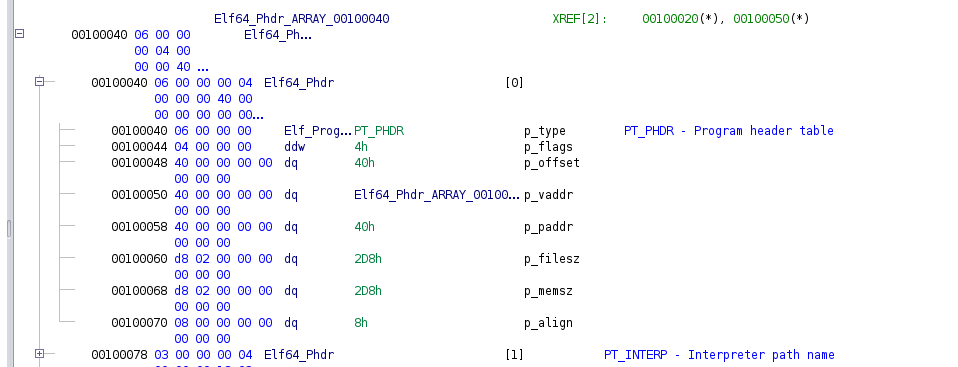

# Segments

So in this page, we will be reviewing some common instances of segments in ELFs.

* [PT_PHDR](#PT_PHDR)
* [PT_INTERP](#PT_INTERP)
* [PT_LOAD](#PT_LOAD)
* [PT_DYNAMIC](#PT_DYNAMIC)
* [PT_NOTE](#PT_NOTE)
* [PT_TLS](#PT_TLS)
* [PT_GNU_EH_FRAME](#PT_GNU_EH_FRAME)
* [PT_GNU_STACK](#PT_GNU_STACK)
* [PT_GNU_RELRO](#PT_GNU_RELRO)

## PT_PHDR

This section, basically just states where the beginning of the program header table is, and where in memory it will be loaded.

Here we see an example of one, with the virtual address `p_vaddr` being `0x40`, pointing to the start of the program header table.


## PT_INTERP

This section's `p_vaddr` and `p_offset` will point to a null terminate string, that is the filepath to the elf interpreter used to run the program.

Here, we see the string is `/lib64/ld-linux-x86-64.so.2`:



## PT_LOAD

So this segment, will specify to load data from the object image elf file, into memory. It basically says "this data at this offset in the elf image file, will be loaded into memory at this address, with these permissions". There will usually be multiple `PT_LOAD` segments.

Let's take a look at the four seperate PT_LOAD entries:


Let's make a chart detailing the relevant information. The `PT_LOAD Segment`s are just the order in which the pictures were shown

| PT_LOAD Segment | p_offset | p_vaddr | Memory Permissions |
| ---- | ---- | ---- | ---- |
| 0 | 0x00000000 | 0x00000000 | Readable |
| 1 | 0x00001000 | 0x00001000 | Readable & Executable |
| 2 | 0x00002000 | 0x00002000 | Readable & Writeable |
| 3 | 0x00002db0 | 0x00003db0 | Readable |

Looking in the elf image file, at the offsets reported in the `PT_LOAD` PHT entries, we see these values:

At Offset `0x00000000`:

```
7f 45 4c 46 02 01 01
```

At Offset `0x00001000`:

```
f3 0f 1e fa 48 83
```

At Offset `0x00002000`:

```
01 00 02 00 54 65
```

Looking in gdb, at virtual addresses `0x0000/0x1000/0x2000`, we see the same data there as expected (keep in mind, PIE base is at `0x0000555555554000`):

```
gef➤  vmmap
[ Legend:  Code | Heap | Stack ]
Start              End                Offset             Perm Path
0x0000555555554000 0x0000555555555000 0x0000000000000000 r-- /elf/try
0x0000555555555000 0x0000555555556000 0x0000000000001000 r-x /elf/try
0x0000555555556000 0x0000555555557000 0x0000000000002000 r-- /elf/try
0x0000555555557000 0x0000555555558000 0x0000000000002000 r-- /elf/try
0x0000555555558000 0x0000555555559000 0x0000000000003000 rw- /elf/try
0x0000555555559000 0x000055555557a000 0x0000000000000000 rw- [heap]
0x00007ffff7c00000 0x00007ffff7c28000 0x0000000000000000 r-- /usr/lib/x86_64-linux-gnu/libc.so.6
0x00007ffff7c28000 0x00007ffff7dbd000 0x0000000000028000 r-x /usr/lib/x86_64-linux-gnu/libc.so.6
0x00007ffff7dbd000 0x00007ffff7e15000 0x00000000001bd000 r-- /usr/lib/x86_64-linux-gnu/libc.so.6
0x00007ffff7e15000 0x00007ffff7e16000 0x0000000000215000 --- /usr/lib/x86_64-linux-gnu/libc.so.6
0x00007ffff7e16000 0x00007ffff7e1a000 0x0000000000215000 r-- /usr/lib/x86_64-linux-gnu/libc.so.6
0x00007ffff7e1a000 0x00007ffff7e1c000 0x0000000000219000 rw- /usr/lib/x86_64-linux-gnu/libc.so.6
0x00007ffff7e1c000 0x00007ffff7e29000 0x0000000000000000 rw- 
0x00007ffff7fa3000 0x00007ffff7fa6000 0x0000000000000000 rw- 
0x00007ffff7fbb000 0x00007ffff7fbd000 0x0000000000000000 rw- 
0x00007ffff7fbd000 0x00007ffff7fc1000 0x0000000000000000 r-- [vvar]
0x00007ffff7fc1000 0x00007ffff7fc3000 0x0000000000000000 r-x [vdso]
0x00007ffff7fc3000 0x00007ffff7fc5000 0x0000000000000000 r-- /usr/lib/x86_64-linux-gnu/ld-linux-x86-64.so.2
0x00007ffff7fc5000 0x00007ffff7fef000 0x0000000000002000 r-x /usr/lib/x86_64-linux-gnu/ld-linux-x86-64.so.2
0x00007ffff7fef000 0x00007ffff7ffa000 0x000000000002c000 r-- /usr/lib/x86_64-linux-gnu/ld-linux-x86-64.so.2
0x00007ffff7ffb000 0x00007ffff7ffd000 0x0000000000037000 r-- /usr/lib/x86_64-linux-gnu/ld-linux-x86-64.so.2
0x00007ffff7ffd000 0x00007ffff7fff000 0x0000000000039000 rw- /usr/lib/x86_64-linux-gnu/ld-linux-x86-64.so.2
0x00007ffffffde000 0x00007ffffffff000 0x0000000000000000 rw- [stack]
0xffffffffff600000 0xffffffffff601000 0x0000000000000000 --x [vsyscall]
gef➤  x/x 0x0000555555554000
0x555555554000:	0x464c457f
gef➤  x/2g 0x0000555555554000
0x555555554000:	0x00010102464c457f	0x0000000000000000
gef➤  x/2g 0x0000555555555000
0x555555555000 <_init>:	0x08ec8348fa1e0ff3	0x4800002fd9058b48
gef➤  x/2g 0x0000555555556000
0x555555556000 <_IO_stdin_used>:	0x7473655400020001	0x3b031b0100000000
```

## PT_DYNAMIC

This segment, will basically contain the `.dynamic` section, thoroughly documented elsewhere in this repo. Here, we see the size of this segment is `0x1f0`, and that this segment points to the `.dynamic` section (`_DYNAMIC`). Since the `.dynamic` section begins at `0x00103dc0` and ends at `0x00103fb0`, it's size is `0x00103fb0 - 0x00103dc0 = 0x1f0`.


## PT_NOTE

This segment primairly just holds infomration, for things like versioning, or other identifying information.


## PT_TLS

This segment primarily points to the thread local storage template.


## PT_GNU_EH_FRAME

This specifies where the excpetion frame handler is.


## PT_GNU_STACK

This segment just specifies the memory permissions on the stack. If this isn't present, that means the stack is executable.

In this example, we see the `p_flags` is `0x06`, which means readable and writeable. Thus the stack in this executable is readable and writeable:


## PT_GNU_RELRO

This segment, will specify which segments to make read only after relocations happen (this is where RELRO comes from).

Here, we see the RELRO segment begins at address `0x001002f0`, and has a size of `0x00104000`. Looking through this range, we see it includes the `.text` section, the `.dynamic` section, the GOT, and some other things.


