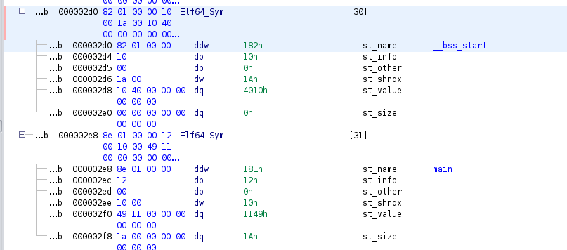
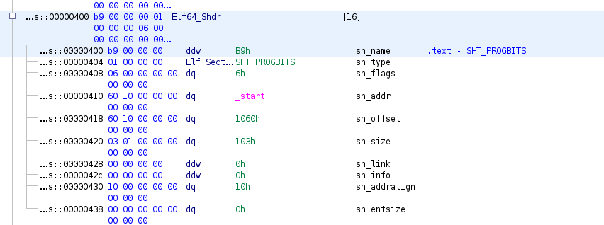
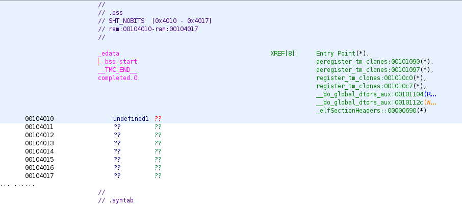

# Symbols

A symbols is just a string name for a piece of data. This could be the name of a function, a global variable, name of a section, or some other type of data. These can be extremely helpful when trying to reverse engineer a piece of code. It can also be used with some linking functionallitities.

## Symbol Sections

So there are some sections that are commonly associated with symbols. The ones we will be discussing here, are `.symtab`, `.strtab`, and `.dynsym`.

The `.symtab` section is a table of symbols. Each entry is a symbol datastructure (either `Elf32_Sym` or `Elf64_Sym`, if it is `32/64` bit), used to model a symbol. Now, the actual string for the symbol is not stored in the `.symtab` section. The `.strtab` section will contain an array of null terminated strings. Each symbol will contain an offset from the start of the `.strtab` section, which will be to the string for the symbol.

Similar to the `.symtab` section, the `.dynsym` section will also contain symbols. The `.dynsym` section will contain a subset of the symbols present in the `.symtab` section (all `.dynsym` symbols will appear in `.symtab`, but not vice versa). The reason for this is, the `.dynsym` section only contain symbols needed at runtime. Certain symbols are needed at runtime, such as the name of a function which will have to be linked from libc (like `puts`). The `dynsym` contains these symbols (known as global symbols). Now, not all symbols are needed at runtime. Some symbols are only needed at link time, or needed for debugging purposes.

Now, a section can be mapped into actual memory when the elf is ran, or it cannot. Sections that are mapped into memory are known as allocable, and sections that aren't mapped are known as non-allocable. The `.dynsym` is allocable (because it's needed at runtime) and the `.symtab` section is non-allocable. This is done to save space in the actual memory of the running program, because symbol tables can grow to be pretty large.

Also, a lot of the symbols present are not actually needed at runtime. One thing certain compilers (or tools that run on compiled ELFs) can do, is strip the symbols. It will remove these unneeded symbols. The benefits of this are to both save on disk space, and to make it harder to reverse engineer. 

## Symbol Structure

So, there is a specific structure which is used to model symbols. This changes depending on if this is a `32` bit, or `64` bit binary:

64 bit symbol:

```
typedef struct {
        Elf64_Word      st_name;
        unsigned char   st_info;
        unsigned char   st_other;
        Elf64_Half      st_shndx;
        Elf64_Addr      st_value;
        Elf64_Xword     st_size;
} Elf64_Sym;
```

32 bit symbol:

```
typedef struct {
        Elf32_Word      st_name;
        Elf32_Addr      st_value;
        Elf32_Word      st_size;
        unsigned char   st_info;
        unsigned char   st_other;
        Elf32_Half      st_shndx;
} Elf32_Sym;
```

Let's go through what the fields represent.

## st_name

This is an offset, from the start of the start of the `.strtab` section. This offset will be to a string, which is the string associated with the symbol.

## st_info

So this value, will contain two seperate values that are contained within them. These two values are the `ST_BIND` and the `ST_TYPE`. There is defined two seperate versions of each, for `64` and `32` bit (`ELF32_ST_BIND/ELF64_ST_BIND/ELF32_ST_TYPE/ELF64_ST_TYPE`).

To calculate `ST_BIND` (shift the value to the right by `4`):

```
#define ELF32_ST_BIND(info)          ((info) >> 4)
#define ELF64_ST_BIND(info)          ((info) >> 4)
```

To calculate `ST_TYPE` (grab the lower `4` bits):

```
#define ELF32_ST_TYPE(info)          ((info) & 0xf)
#define ELF64_ST_TYPE(info)          ((info) & 0xf)
```

Basically the `st_info` is a single byte value (8 bits). The `ST_BIND` value is the higher `4` bits, and `ST_TYPE` is the lower `4` bits. Here is how you can generate the `st_info` value based on the `ST_TYPE/ST_BIND` values:

```
#define ELF32_ST_INFO(bind, type)    (((bind)<<4)+((type)&0xf))
#define ELF64_ST_INFO(bind, type)    (((bind)<<4)+((type)&0xf))
```

Now, here is a chart, mapping `ST_BIND` values to their meanings:

| Name | Value |
| ---- | ---- |
| STB_LOCAL | 0x00 |
| STB_GLOBAL | 0x01 |
| STB_WEAK | 0x02 |
| STB_LOOS | 0x0a |
| STB_HIOS | 0x0c |
| STB_LOPROC | 0x0d |
| STB_HIPROC | 0x0f |

#### STB_LOCAL

This is a local symbol. That means, this symbol is local to the object image file (the ELF file) which the symbol resides in. This way, the same symbol can exist in multiple object image files, but be local to individual files.

#### STB_GLOBAL

This is a global symbol. These symbols are global to all object image files. If this symbol is defined in one object image file, it will be present in all object image files. This is used for things, like defining a function which is present in one object image file, but used in others.

#### STB_WEAK

A weak symbol, is a global symbol, but have lower precedence than global symbols. I believe this is so, you can have a global symbol that can be overrided by other global symbols.

#### STB_LOOS/STB_HIOS

We have another range, for OS specific definitions.

#### STB_LOPROC/STB_HIPROC

We have another range, for Processor specific definitions.

Here is a chart, mapping `ST_TYPE` to their specific values:

| Name | Value |
| ---- | ---- |
| STT_NOTYPE | 0x00 |
| STT_OBJECT | 0x01 |
| STT_FUNC | 0x02 |
| STT_SECTION | 0x03 |
| STT_FILE | 0x04 |
| STT_COMMON | 0x05 |
| STT_LOOS | 0x0a |
| STT_HIOS | 0x0c |
| STT_LOPROC | 0x0d |
| STT_HIPROC | 0x0f |


#### STT_NOTYPE

This symbol is not associated with any particular type.

#### STT_OBJECT

This symbol is associated with a piece of data, like a global variable, array, integer, boolean, etc.

#### STT_FUNC

This symbol is associated with a function, or other exeuctable code.

#### STT_SECTION

This symbol is associated with a section.

#### STT_FILE

This symbol is associated with a source file, typically used for the source file that generated the object file.

#### STT_COMMON

This symbol is associated with a block of uninitialized data, and is treated similar to `STT_OBJECT`.

#### STT_LOOS/STT_HIOS

We have another range, for OS specific definitions.

#### STT_LOPROC/STT_HIPROC

We have another range, for Processor specific definitions.

## st_other

This is a single byte value, that defines the symbol's visibility. In practicallity, only the last three bits are used:

```
#define ELF32_ST_VISIBILITY(o)       ((o)&0x3)
#define ELF64_ST_VISIBILITY(o)       ((o)&0x3)
```

Here is a chart mapping the specific symbol visibility values:

| Name | Value |
| ---- | ---- |
| STV_DEFAULT | 0x00 |
| STV_INTERNAL | 0x01 |
| STV_HIDDEN | 0x02 |
| STV_PROTECTED | 0x03 |

#### STV_DEFAULT

The symbol's visibility is defined by the `ST_BIND` value (weak/global/local). Global/weak symbols can be preempted (overrided) by other symbols potentially. This appears to be the most common.

#### STV_INTERNAL

This visibility is currently reserved.

#### STV_HIDDEN

This is sort of like a local symbol. It's name is not visible to other componets, but if the address of the symbol is passed to other componets, it can be referenced.

Oftem times, this symbol will be converted to `STB_LOCAL` by a link editor, when the relocatable object is included with an executable or shared object.

#### STV_PROTECTED

A symbol type that is protected means that it cannot be preempted, from the perspective of the definning componet. Any references to this symbol, from the definning componet, must map to this symbol, even if multiple copies of the symbol exists in seperate components.

## st_shndx

So this symbol maps to a particular piece of data. This data is present in some section. This value is the index, in the section header table, to the section which contains the data that this symbol maps to.

There can also be special index values, that mean special things. Like `SHN_ABS` means that the symbol has a value that will not change because of relocation. `SHN_COMMON` means that this is a common block that has not been allocated. `SHN_UNDEF` means that the symbol is undefined.

## st_value

This holds the actual value of the symbol.

For executables and shared object files, this holds the virtual address to the piece of data which the symbol corresponds to.

For relocatable files, this specifies the offset from the start of the section (specifed by `st_shndx`) that corresponds to what this symbol maps to.

For relocatable files that have a `st_shndx` value of `SHN_COMMON`, that means that this value is the alignment constriant for the data this symbol maps to.

## st_size

This holds the size of the data associated with the symbol. For example, if it is a function, the size of the function. If the size of the symbol is unknown, this value is `0x00`.

# Symbol Practical Examples

Let's take a look at actual symbols of a binary in ghidra. Here, we see the symbols for both `__bss_start` and `main`, from the `.symtab` section:



So we see that the `__bss_start` symbol is at offset `0x182`, and `main` is at offset `0x18e`, each from the start of the `.strtab` section, which we see here:


We see that `__bss_start`'s `st_info` value is `0x10`. That means that it has a `ST_BIND` value of (`0x10 >> 4 = 0x1`), which corresponds to STB_GLOBAL, so it is a global symbol. It's `ST_TYPE` value is `0x10 & 0x0f = 0x00`, which means it is `STT_NOTYPE`.

The `main` symbol on the other hand, has a `st_info` value of `0x12`. So it's `ST_BIND` value is `0x1`, and it's `ST_TYPE` value is `0x02`, which corresponds to `STT_FUNC`. Both of these are what we'd expect.

Both of the `st_other` values are `0x00`.

We see that the `main` symbol's `st_shndx` value is `0x10`, and that the `__bss_start` symbol's `st_shndx` value is `0x1a`.

We see that the `main` symbol resolves to code in the `.text` section, which is what we would expect:



We see that the `__bss_start` symbol resolves to code in the `.bss` section, which is what we would expect:


Looking at the `st_value/st_size` values for the main symbol, we see that it's value is `0x1149`, and it's size is `0x1a`. We see in ghidra, the main function is at `0x101149` (the reason it's `0x100000 + 0x1149` is because ghidra has the base address at `0x100000`). We also see that it ends at `0x00101162`, which means that it's size is `((0x00101162 - 0x101149) + 1) = 0x1a`, which matches the symbol values:


For the `__bss_start` symbol, we see it's value is `0x4010`, which corresponds to the ghidra address `0x104010`, which we see is the start of the `.bss` section as we expect. We also see that the size is `0x00`, which means that the symbol doesn't know the size:


